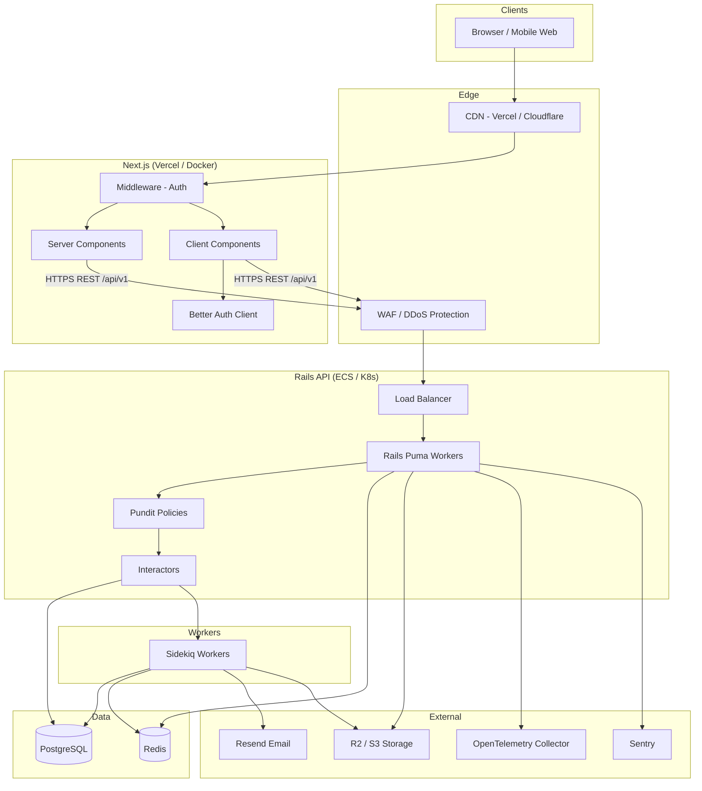
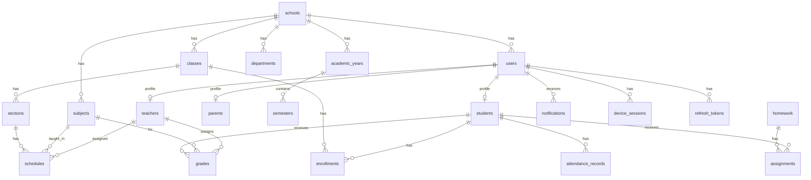
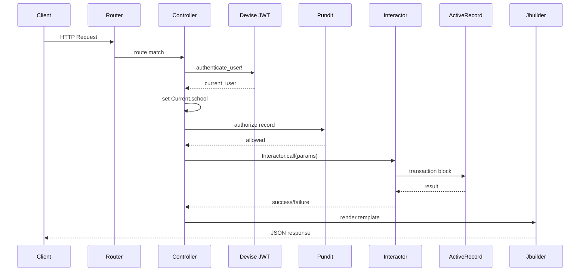
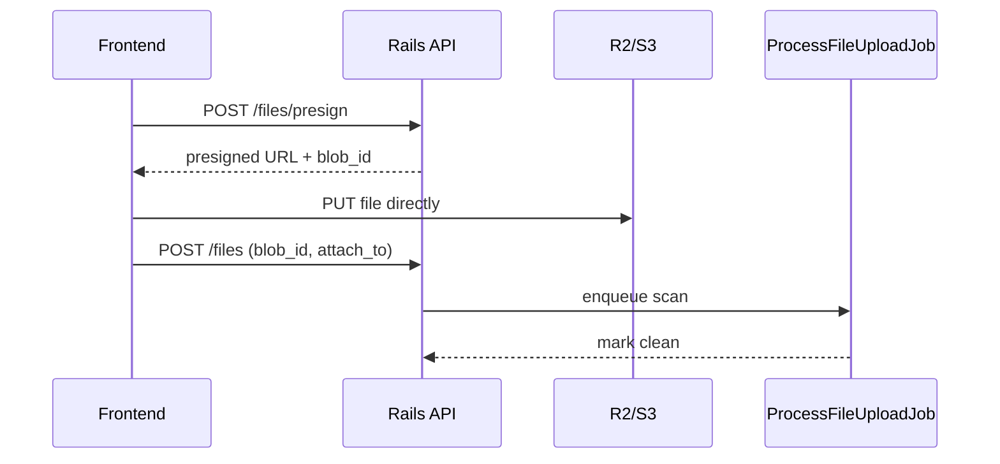
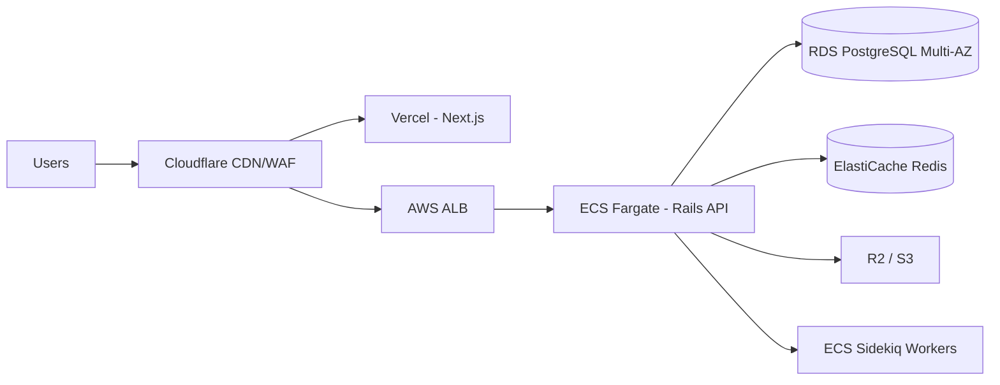
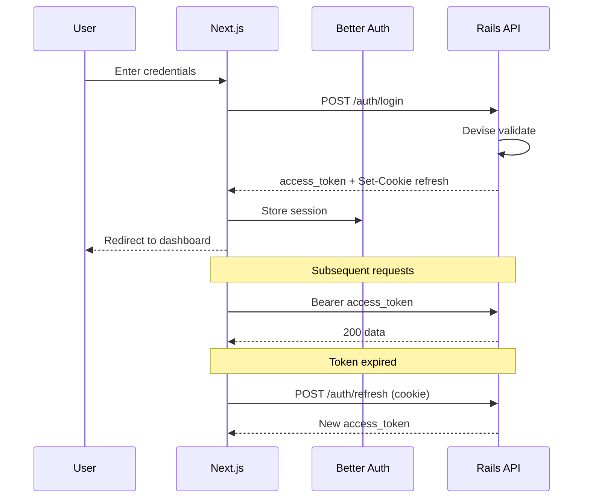
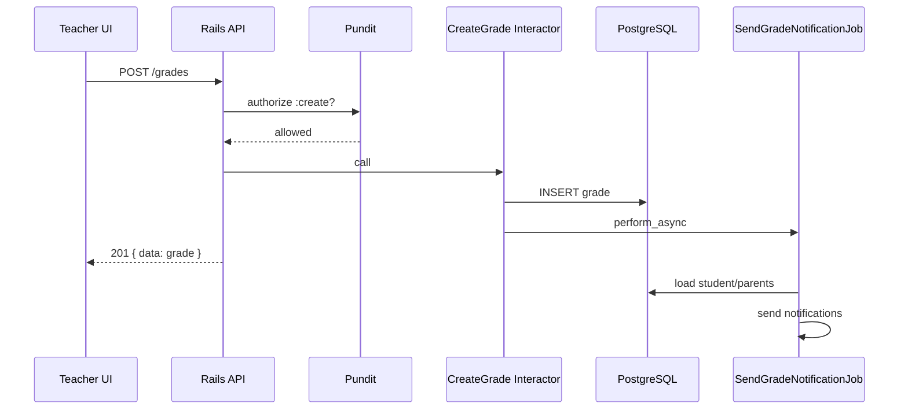
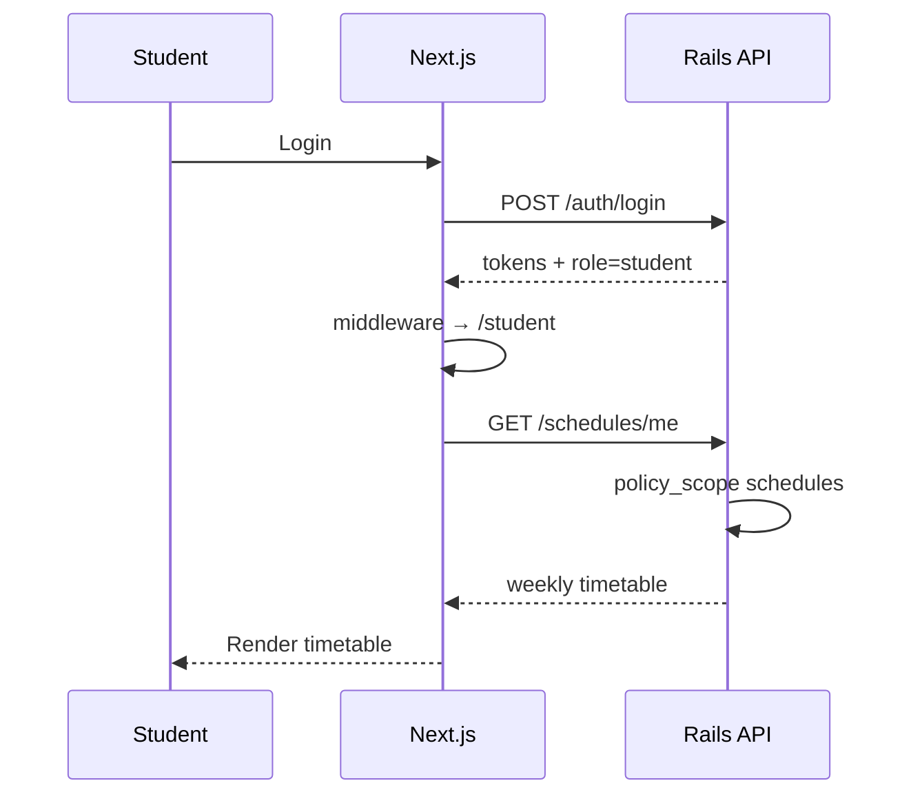
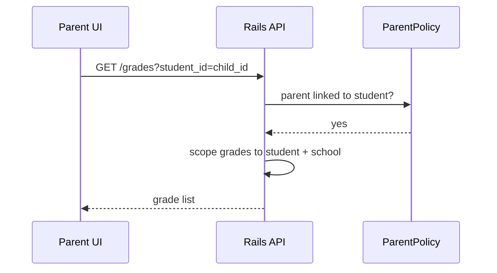
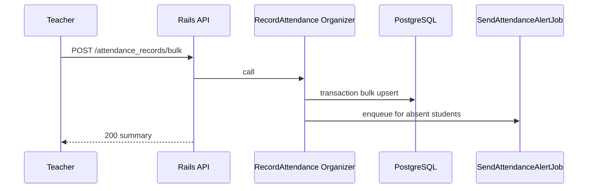

# Software Architecture Document (SAD)

**Product:** Tafakkur LMS — Multi-Tenant SaaS Learning Management System  
**Version:** 1.0  
**Date:** July 2026  
**Status:** Approved for implementation  

**Related documents:**

- Frontend planning: [frontend-schema.md](./frontend-schema.md)
- Multi-tenancy: [multi-tenancy.md](./multi-tenancy.md)
- Database schema: [../database/schema.md](../database/schema.md)
- API guidelines: [../api/README.md](../api/README.md)

---

## Table of Contents

1. [Executive Summary](#1-executive-summary)
2. [Technology Decisions](#2-technology-decisions)
3. [High-Level Architecture](#3-high-level-architecture)
4. [Multi-Tenant Strategy](#4-multi-tenant-strategy)
5. [Database Design](#5-database-design)
6. [Frontend Architecture](#6-frontend-architecture)
7. [Backend Architecture](#7-backend-architecture)
8. [Authentication](#8-authentication)
9. [Authorization](#9-authorization)
10. [REST API Design](#10-rest-api-design)
11. [Background Jobs](#11-background-jobs)
12. [File Storage](#12-file-storage)
13. [Email Architecture](#13-email-architecture)
14. [Security](#14-security)
15. [Testing](#15-testing)
16. [Docker Setup](#16-docker-setup)
17. [CI/CD](#17-cicd)
18. [Production Infrastructure](#18-production-infrastructure)
19. [Monitoring](#19-monitoring)
20. [Performance Strategy](#20-performance-strategy)
21. [Mermaid Diagrams](#21-mermaid-diagrams)
22. [Development Roadmap](#22-development-roadmap)
23. [MVP Roadmap](#23-mvp-roadmap)
24. [Future Scaling Strategy](#24-future-scaling-strategy)

---

## 1. Executive Summary

Tafakkur LMS is an enterprise-grade, multi-tenant SaaS platform enabling schools to manage students, teachers, parents, academic operations, communication, and analytics. Each school operates as an isolated tenant sharing a common application stack.

### Goals

| Goal | Target |
|------|--------|
| Availability | 99.9% uptime (~8.76 h downtime/year) |
| API latency | <200 ms p95 for standard CRUD |
| Dashboard load | <2 s LCP |
| Scale | Thousands of schools, millions of users |
| Security | OWASP Top 10, GDPR-ready, strict tenant isolation |
| Maintainability | Clean Architecture (Rails-appropriate), feature-oriented frontend |

### Architecture Style

- **Monolith-first** Rails API + Next.js SPA/SSR hybrid
- **Shared database multi-tenancy** with `school_id` column
- **Stateless API** behind load balancer, horizontal scaling
- **Async work** via Sidekiq + Redis
- **Object storage** for files (R2/S3)

This approach optimizes for time-to-market, operational simplicity, and cost efficiency while preserving a clear path to modular extraction at scale.

---

## 2. Technology Decisions

### 2.1 Decision Summary Table

| Technology | Decision | Primary reason |
|------------|----------|----------------|
| Rails API | Backend framework | Mature ecosystem, conventions, rapid domain modeling |
| Next.js | Frontend framework | App Router, RSC, SEO, Vercel deployment |
| PostgreSQL | Primary database | ACID, JSONB, partial indexes, row-level security option |
| Redis | Cache + job queue | Sub-ms reads, Sidekiq backend |
| Sidekiq | Background jobs | Battle-tested Ruby job processing |
| Devise + Devise JWT | Backend auth | Standard Rails auth with JWT dispatch |
| Better Auth | Frontend auth client | Session UX, cookie handling, Next.js integration |
| Pundit | Authorization | Explicit policy objects, testable RBAC |
| Interactor | Business logic | Single-purpose service objects, transaction boundaries |
| Versionist | API versioning | Clean `/api/v1` routing |
| Jbuilder | JSON serialization | Declarative views, no heavy serializer gem |
| HeroUI 3.2.2 | UI components | Accessible React Aria primitives, Tailwind v4 |
| Wretch | HTTP client | Lightweight, composable fetch wrapper |
| Active Storage | File uploads | Rails-native, direct upload support |
| Resend | Transactional email | Developer experience, deliverability |
| Docker | Containerization | Reproducible dev/prod environments |

### 2.2 Detailed Technology ADRs

#### Rails API

**Why:** Domain-rich LMS maps naturally to Active Record; Interactor + Pundit patterns are well-established; hiring and maintenance costs are lower than microservices at this stage.

**Advantages:** Convention over configuration, migrations, mature gems, fast CRUD + business logic iteration.

**Disadvantages:** Ruby GIL limits single-process CPU parallelism; not ideal if sub-10ms latency at massive scale is required.

**Alternatives rejected:** NestJS (team Ruby expertise), Go microservices (premature complexity), Supabase-only (insufficient custom business logic layer).

#### Next.js

**Why:** App Router with Server Components reduces client JS; integrates with Vercel CDN; strong TypeScript ecosystem.

**Advantages:** RSC data fetching, middleware auth, i18n routing, edge-ready.

**Disadvantages:** Framework complexity; careful Server/Client boundary required.

**Alternatives rejected:** Remix (smaller HeroUI ecosystem), CRA/SPA-only (worse initial load, no SSR).

#### HeroUI 3.2.2

**Why:** Project standard; accessible primitives; Tailwind v4 native; no provider wrapper required.

**Advantages:** Consistent design system, React Aria a11y, reduced custom CSS.

**Disadvantages:** Vendor lock-in to component API; major version upgrades need migration.

**Alternatives rejected:** shadcn (more assembly required), MUI (heavier bundle).

#### Wretch

**Why:** Minimal API surface vs Axios; works with native fetch; easy interceptors for JWT refresh.

**Advantages:** Tree-shakeable, TypeScript-friendly, no XMLHttpRequest legacy.

**Disadvantages:** Less built-in than Axios (retry, upload progress need custom code).

**Alternatives rejected:** Axios (heavier), tRPC (backend is REST Rails, not RPC).

#### Better Auth

**Why:** Modern Next.js auth client; handles session cookies and client state; complements Rails JWT API.

**Advantages:** Good DX for App Router; extensible plugins.

**Disadvantages:** Two auth layers (Better Auth client + Devise JWT server) require clear contract.

**Alternatives rejected:** NextAuth alone (Rails is source of truth for credentials), custom auth (security risk).

**Integration pattern:** Better Auth manages frontend session; Rails issues JWT access + refresh tokens; Next.js `/api/auth/*` proxies token refresh to Rails.

#### PostgreSQL

**Why:** Relational integrity for grades, enrollments, attendance; excellent indexing; optional RLS for defense-in-depth.

**Advantages:** FK constraints, partial indexes, full-text search, JSONB for settings.

**Disadvantages:** Vertical scaling limits; complex sharding if single-DB exceeds capacity.

**Alternatives rejected:** MySQL (weaker JSON/index features), MongoDB (relational data ill-fit).

#### Redis

**Why:** Session cache, rate limiting counters, Sidekiq queue, fragment cache.

**Advantages:** In-memory speed, pub/sub for future real-time.

**Disadvantages:** Another service to operate; persistence configuration needed.

#### Sidekiq

**Why:** Standard Rails background processing; retry/dead letter built-in.

**Advantages:** Web UI, batch jobs, scheduled jobs (sidekiq-cron).

**Disadvantages:** Ruby process memory; not for long-running streaming jobs.

**Alternatives rejected:** Solid Queue (newer, less Sidekiq ecosystem), Celery (wrong language).

#### Pundit

**Why:** Explicit `Policy` classes per model; `Scope` for tenant + role filtering.

**Advantages:** Testable, readable authorization; integrates with controller `authorize`.

**Disadvantages:** Boilerplate per resource.

**Alternatives rejected:** CanCanCan (magic abilities harder to audit), Rolify-only (no resource policies).

#### Interactor

**Why:** Organizes business logic in composable contexts with rollback.

**Advantages:** Transaction boundaries, organized specs, reusable organizers.

**Disadvantages:** Extra indirection vs plain service objects.

**Alternatives rejected:** Fat models (unmaintainable), dry-transaction (heavier DSL).

#### Active Storage

**Why:** Native Rails uploads, direct upload to S3/R2, variant processing.

**Advantages:** Integrated with models; signed URLs.

**Disadvantages:** Less feature-rich than dedicated DAM; virus scan needs plugin job.

#### Resend

**Why:** Simple API, good deliverability, React email template support.

**Advantages:** Fast integration, webhooks for bounces.

**Disadvantages:** Vendor dependency; high volume may need dedicated ESP.

---

## 3. High-Level Architecture



### Component Responsibilities

| Component | Responsibility |
|-----------|----------------|
| Next.js | UI, routing, i18n, client auth session, server data prefetch |
| Rails API | Auth, authorization, business logic, persistence, webhooks |
| PostgreSQL | System of record, constraints, indexes |
| Redis | Cache, rate limits, job queues |
| Sidekiq | Email, notifications, reports, exports, cleanup |
| R2/S3 | Private/public file blobs |
| Resend | Transactional email delivery |

---

## 4. Multi-Tenant Strategy

### 4.1 Decision: Shared Database + `school_id`

**Chosen approach:** Single PostgreSQL database; every tenant-owned row includes `school_id UUID NOT NULL`.

### 4.2 Comparison

| Criterion | DB per tenant | Schema per tenant | Shared DB + school_id |
|-----------|---------------|-------------------|----------------------|
| Data isolation | Strongest | Strong | Good (app + optional RLS) |
| Migration complexity | O(tenants) | O(tenants) | O(1) |
| Infra cost | Highest | High | Lowest |
| Cross-tenant analytics | Hard | Hard | Easy (platform admin) |
| Connection pooling | Complex | Complex | Simple |
| Enterprise dedicated DB | Native | Native | Hybrid export path |

**Why shared DB wins:** Thousands of schools with mostly similar schemas; single migration pipeline; lower ops burden; sufficient isolation with strict scoping + Pundit + FK constraints. Enterprise customers requiring physical isolation can be migrated to dedicated DB later (see §24).

### 4.3 Tenant Resolution

1. User authenticates → JWT contains `user_id`, `school_id`, `role`.
2. `Current.school = user.school` set in `ApplicationController`.
3. All queries use `policy_scope(Model)` or `Model.where(school_id: Current.school.id)`.
4. **Never** accept `school_id` from request body or query params for authorization.

### 4.4 Defense in Depth

- Application-level: Pundit scopes, Interactor validation
- Database-level: Composite indexes leading with `school_id`; optional PostgreSQL RLS
- Audit: `audit_logs` table records cross-tenant attempts
- Tests: Request specs assert tenant A cannot read tenant B records

### 4.5 Scaling Strategy

- Read replicas for reporting/analytics queries
- Partition large tables by `school_id` or time when rows exceed 100M
- Cache tenant settings in Redis (`school:{id}:settings`)

### 4.6 Migration Strategy

- Single `db/migrate` pipeline
- Backfill `school_id` on seed/import with NOT NULL constraint after backfill
- Large tenant export: pg_dump with `--where school_id='...'` for dedicated DB migration

---

## 5. Database Design

### 5.1 Conventions

- **Primary keys:** UUID v7 (time-sortable) via `gen_random_uuid()` or app-generated
- **Timestamps:** `created_at`, `updated_at` on all tables
- **Soft delete:** `discarded_at` (Discard gem) on user-facing entities
- **Audit:** `created_by_id`, `updated_by_id` where mutations need attribution
- **Tenant column:** `school_id UUID NOT NULL REFERENCES schools(id)` on tenant tables
- **Naming:** snake_case plural tables; `_id` foreign keys

### 5.2 Entity Relationship Overview



### 5.3 Complete Table Definitions

#### schools

| Column | Type | Notes |
|--------|------|-------|
| id | UUID PK | |
| name | VARCHAR(255) NOT NULL | |
| slug | VARCHAR(100) UNIQUE | Subdomain/path routing |
| domain | VARCHAR(255) UNIQUE NULL | Custom domain optional |
| timezone | VARCHAR(64) DEFAULT 'UTC' | |
| locale | VARCHAR(10) DEFAULT 'en' | |
| settings | JSONB DEFAULT '{}' | Branding, features |
| subscription_status | VARCHAR(32) | active, trial, suspended |
| discarded_at | TIMESTAMPTZ NULL | Soft delete |

**Indexes:** `UNIQUE(slug)`, `UNIQUE(domain) WHERE domain IS NOT NULL`

#### subscriptions

| Column | Type | Notes |
|--------|------|-------|
| id | UUID PK | |
| school_id | UUID FK UNIQUE | One active per school |
| plan | VARCHAR(64) | starter, pro, enterprise |
| status | VARCHAR(32) | |
| current_period_end | TIMESTAMPTZ | |
| metadata | JSONB | |

#### users

| Column | Type | Notes |
|--------|------|-------|
| id | UUID PK | |
| school_id | UUID FK NOT NULL | Tenant scope |
| email | VARCHAR(255) NOT NULL | |
| encrypted_password | VARCHAR(255) | Devise |
| role | VARCHAR(32) NOT NULL | admin, teacher, student, parent |
| first_name | VARCHAR(100) | |
| last_name | VARCHAR(100) | |
| phone | VARCHAR(32) NULL | |
| email_verified_at | TIMESTAMPTZ NULL | |
| last_sign_in_at | TIMESTAMPTZ | |
| discarded_at | TIMESTAMPTZ NULL | |

**Indexes:** `UNIQUE(school_id, email)`, `INDEX(school_id, role)`, `INDEX(school_id, discarded_at)`

**Why composite unique on (school_id, email):** Same email can exist at different schools; not globally unique.

#### roles / permissions (RBAC extension)

#### roles

| id | UUID PK |
| school_id | UUID FK NULL | NULL = system role template |
| name | VARCHAR(64) |
| permissions | JSONB | `{ "students": ["read","write"], ... }` |

#### refresh_tokens

| id | UUID PK |
| user_id | UUID FK |
| token_digest | VARCHAR(255) | Hashed refresh token |
| device_name | VARCHAR(255) |
| ip_address | INET |
| user_agent | TEXT |
| expires_at | TIMESTAMPTZ |
| revoked_at | TIMESTAMPTZ NULL |
| replaced_by_id | UUID FK NULL | Rotation chain |

**Indexes:** `INDEX(user_id, revoked_at)`, `UNIQUE(token_digest)`

#### device_sessions

Links refresh tokens to user-visible device list for "logout all devices."

#### teachers, students, parents

Profile tables linking `user_id` to domain fields.

**teachers:** `employee_id`, `department_id`, `hire_date`, `bio`  
**students:** `student_code`, `date_of_birth`, `gender`, `address` (encrypted at app layer if PII policy requires)  
**parents:** `occupation`, `address`

**Indexes:** `UNIQUE(school_id, student_code)` on students; `INDEX(school_id, user_id)` all profiles

#### parent_students (join)

| parent_id | UUID FK |
| student_id | UUID FK |
| relationship | VARCHAR(32) | mother, father, guardian |
| school_id | UUID FK | Denormalized for scope |

**UNIQUE(parent_id, student_id)**

#### departments

| school_id | name | parent_id NULL | Tree structure |

**INDEX(school_id, parent_id)**

#### academic_years

| school_id | name | starts_on | ends_on | status | current BOOLEAN |

**UNIQUE(school_id, name)**, partial unique on `(school_id) WHERE current = true`

#### semesters

| academic_year_id | name | starts_on | ends_on | school_id |

#### classes

| school_id | name | academic_year_id | department_id | homeroom_teacher_id NULL |

#### sections

| class_id | name | capacity | school_id |

**UNIQUE(class_id, name)**

#### subjects

| school_id | name | code | department_id | credit_hours |

**UNIQUE(school_id, code)**

#### subject_assignments

Teacher-subject-class mapping.

| teacher_id | subject_id | class_id | section_id NULL | school_id |

#### enrollments

| student_id | class_id | section_id | academic_year_id | status | enrolled_on |

**UNIQUE(student_id, academic_year_id)** — one class per year

#### schedules

| section_id | subject_id | teacher_id | day_of_week | starts_at | ends_at | room | school_id |

**INDEX(school_id, section_id, day_of_week)**

#### lessons

| schedule_id | title | content | lesson_date | school_id |

#### attendance_records

| student_id | section_id | date | status | recorded_by_id | notes | school_id |

**UNIQUE(student_id, section_id, date)**  
**INDEX(school_id, date, section_id)** — daily attendance queries

#### grades

| student_id | subject_id | teacher_id | semester_id | grade_type | value | max_value | weight | recorded_at | school_id |

**INDEX(school_id, student_id, semester_id)**  
**INDEX(school_id, subject_id, semester_id)**

#### homework

| title | description | subject_id | class_id | section_id NULL | teacher_id | due_at | school_id |

#### assignments

| homework_id | student_id | status | submitted_at | score NULL | feedback | school_id |

#### exams

| title | subject_id | class_id | section_id NULL | scheduled_at | duration_minutes | max_score | school_id |

#### announcements

| title | body | author_id | target_type | target_ids JSONB | published_at | school_id |

#### notifications

| user_id | title | body | read_at NULL | notifiable_type | notifiable_id | school_id |

**INDEX(school_id, user_id, read_at)**

#### messages

| sender_id | recipient_id | body | read_at | school_id |

#### audit_logs

| school_id | user_id | action | auditable_type | auditable_id | metadata JSONB | ip_address | created_at |

**INDEX(school_id, created_at DESC)** — compliance queries

#### active_storage_* (Rails default)

Blob metadata; `school_id` added to `active_storage_attachments` polymorphic context via record association.

### 5.4 Performance Maintenance

- **No N+1:** Strict `includes`/`preload` in interactors; Bullet gem in development
- **Partial indexes:** e.g. `WHERE discarded_at IS NULL`
- **Connection pooling:** PgBouncer transaction mode in production
- **Vacuum/analyze:** Automated via managed PostgreSQL
- **Query timeouts:** `statement_timeout = 30s` default
- **Explain analyze:** Required for any query >50ms in staging

---

## 6. Frontend Architecture

See **[frontend-schema.md](./frontend-schema.md)** for the complete planning view (routes, features, phases).

### 6.1 Principles

- **Server Components default** — data fetch on server, minimal client JS
- **Feature modules** — domain logic colocated under `src/features/`
- **Thin routes** — `app/` only wires layouts and pages
- **HeroUI only** — no custom Button/Input/Modal replacements
- **Strict TypeScript** — no `any`

### 6.2 Server vs Client Components

| Use Server Component | Use Client Component |
|---------------------|---------------------|
| Initial data fetch | useState, useEffect |
| Access backend directly (server) | Event handlers, onClick |
| SEO metadata | Browser APIs |
| Static layout shells | React Hook Form |
| Permission check before render | Optimistic UI |
| | Charts (Recharts) |

### 6.3 API Layer (Wretch)

```typescript
// lib/api/client.ts
const api = wretch(process.env.NEXT_PUBLIC_API_URL!)
    .options({ credentials: "include" })
    .middlewares([authInterceptor, errorParser]);
```

Services in `features/*/services/` call `api.url('/students').get()`.

### 6.4 Error Handling

- Global: `error.tsx` boundaries per route segment
- API errors: parse `{ error: { code, message, details } }` → toast + inline field errors
- 401: trigger token refresh; on failure redirect `/login`

### 6.5 Caching

- RSC: `fetch` with `next: { tags: ['students'], revalidate: 60 }`
- Client lists: stale-while-revalidate pattern
- Mutations: `revalidateTag` via Server Actions

### 6.6 Accessibility & i18n

- HeroUI + React Aria: focus management, ARIA labels
- next-intl: locale prefix routing `/en/...`, `/uz/...`
- All user strings in JSON message files — no hardcoded UI text

---

## 7. Backend Architecture

### 7.1 Folder Structure

```
app/
├── controllers/
│   ├── application_controller.rb
│   └── api/
│       └── v1/
│           ├── base_controller.rb
│           ├── auth_controller.rb
│           ├── students_controller.rb
│           └── ...
├── models/
│   ├── concerns/
│   │   ├── tenant_scoped.rb
│   │   └── discardable.rb
│   └── ...
├── policies/
├── interactors/
│   ├── students/
│   │   ├── create.rb
│   │   └── enroll.rb
│   └── organizers/
├── jobs/
├── mailers/
├── views/
│   └── api/v1/
│       ├── students/
│       │   ├── index.json.jbuilder
│       │   └── _student.json.jbuilder
│       └── shared/
├── queries/          # Complex read queries (optional)
└── services/         # Thin wrappers for external APIs (Resend, storage)

config/
├── routes.rb
├── initializers/
│   ├── devise.rb
│   ├── sidekiq.rb
│   └── rack_attack.rb
└── ...

db/
├── migrate/
├── structure.sql     # Optional schema dump
└── seeds/

spec/
├── models/
├── requests/
├── policies/
├── interactors/
└── jobs/
```

### 7.2 Folder Responsibilities

| Folder | Responsibility |
|--------|----------------|
| `controllers/api/v1/` | HTTP layer: auth, authorize, params, render |
| `models/` | Persistence, validations, associations, scopes |
| `policies/` | Authorization rules and scoped queries |
| `interactors/` | Business logic, transactions |
| `jobs/` | Async Sidekiq work |
| `views/api/v1/` | Jbuilder JSON templates |
| `queries/` | Complex read-only query objects |
| `services/` | External integrations (email, storage signing) |
| `concerns/` | Shared model/controller behavior |

### 7.3 Request Lifecycle



### 7.4 Transaction Handling

- Interactors wrap writes in `ActiveRecord::Base.transaction`
- Use `Interactor::Organizer` for multi-step flows (e.g., enroll student → create enrollment → notify parent)
- On failure: `context.fail!(error: ...)` rolls back transaction
- Idempotency keys for critical jobs (payment, bulk import)

### 7.5 Error Handling

| Error | HTTP | Code |
|-------|------|------|
| Validation failed | 422 | `validation_error` |
| Not found | 404 | `not_found` |
| Unauthorized | 401 | `unauthorized` |
| Forbidden | 403 | `forbidden` |
| Rate limited | 429 | `rate_limit_exceeded` |

```json
{
  "error": {
    "code": "validation_error",
    "message": "Record could not be saved",
    "details": [{ "field": "email", "message": "has already been taken" }]
  }
}
```

### 7.6 API Versioning

Versionist gem mounts v1:

```ruby
namespace :api do
  api_version(module: 'V1', path: { value: 'v1' }, defaults: { format: :json }) do
    resources :students
  end
end
```

Breaking changes → v2; v1 supported minimum 12 months.

---

## 8. Authentication

### 8.1 Stack

- **Devise** — user model, password hashing (bcrypt), recoverable, confirmable
- **Devise JWT** — dispatch access token on login; denylist revocation
- **Refresh tokens** — custom `refresh_tokens` table with rotation
- **Better Auth (frontend)** — session UX, cookie storage for refresh token

### 8.2 Token Lifecycle

| Token | Lifetime | Storage | Rotation |
|-------|----------|---------|----------|
| Access JWT | 15 minutes | Memory (client) | New on refresh |
| Refresh token | 30 days (7 days without remember me) | httpOnly Secure SameSite cookie | Single-use rotation |

**Refresh rotation:** Each refresh invalidates previous token (`replaced_by_id` chain detects reuse → revoke all sessions).

### 8.3 Flows

**Login:** POST `/api/v1/auth/login` → validate credentials → issue access + refresh → audit log  
**Refresh:** POST `/api/v1/auth/refresh` → validate refresh digest → new pair → revoke old refresh  
**Logout:** POST `/api/v1/auth/logout` → revoke current refresh  
**Logout all:** DELETE `/api/v1/auth/sessions` → revoke all refresh tokens for user  
**Password reset:** POST `/api/v1/auth/password` → email via Resend → token → PATCH reset  
**Email verify:** GET `/api/v1/auth/confirmation?token=` → set `email_verified_at`

### 8.4 Security

- bcrypt cost factor 12+
- Rate limit login: 5 attempts / 15 min / IP + email (Rack::Attack)
- No credentials in logs
- JWT claims: `sub`, `school_id`, `role`, `exp`, `jti`
- Denylist `jti` on logout for access token until expiry

---

## 9. Authorization

### 9.1 RBAC Model

| Role | Scope |
|------|-------|
| admin | Full school management |
| teacher | Assigned classes, subjects, students in those classes |
| student | Own records only |
| parent | Linked children only |

### 9.2 Pundit Pattern

```ruby
class StudentPolicy < ApplicationPolicy
  def show?
    admin? || assigned_teacher?(record) || own_student?(record) || parent_of?(record)
  end

  class Scope < Scope
    def resolve
      if user.admin?
        scope.where(school_id: user.school_id)
      elsif user.teacher?
        scope.where(school_id: user.school_id).in_teacher_classes(user.teacher)
      # ...
      end
    end
  end
end
```

### 9.3 Authorization Flow

1. Authenticate user
2. Load resource through `policy_scope` (tenant + role filtered)
3. `authorize @record, :action?`
4. Interactor re-validates business rules (defense in depth)

### 9.4 Permission Inheritance

- Admin inherits all permissions within tenant
- Custom roles (future): JSONB permissions on `roles` table override defaults
- Feature flags in `school.settings` can disable modules (e.g., messaging)

---

## 10. REST API Design

**Base URL:** `https://api.example.com/api/v1`  
**Auth header:** `Authorization: Bearer <access_token>`

### 10.1 Global Conventions

**Pagination:** `?page=1&limit=25` (max 100)

**Response meta:**
```json
{
  "data": [...],
  "meta": { "page": 1, "limit": 25, "total": 240, "total_pages": 10 }
}
```

**Filtering:** query params (`?class_id=`, `?status=active`)  
**Sorting:** `?sort=last_name&order=asc`  
**Searching:** `?q=john` (pg_trgm indexed columns)

### 10.2 Authentication Endpoints

| Method | URL | Auth | Purpose |
|--------|-----|------|---------|
| POST | `/auth/login` | Public | Login |
| POST | `/auth/refresh` | Refresh cookie | Rotate tokens |
| POST | `/auth/logout` | Bearer | Logout device |
| DELETE | `/auth/sessions` | Bearer | Logout all |
| POST | `/auth/password` | Public | Request reset |
| PATCH | `/auth/password` | Token | Reset password |
| GET | `/auth/confirmation` | Token | Verify email |
| GET | `/auth/sessions` | Bearer | List devices |

**Login request:**
```json
{ "email": "admin@school.com", "password": "secret", "remember_me": true }
```

**Login response (201):**
```json
{
  "data": {
    "access_token": "eyJ...",
    "expires_in": 900,
    "user": { "id": "...", "email": "...", "role": "admin", "school_id": "..." }
  }
}
```

### 10.3 Schools & Settings

| Method | URL | Auth | Authz |
|--------|-----|------|-------|
| GET | `/school` | Bearer | any user |
| PATCH | `/school` | Bearer | admin |
| GET | `/settings` | Bearer | admin |
| PATCH | `/settings` | Bearer | admin |

### 10.4 Teachers

| Method | URL | Authz |
|--------|-----|-------|
| GET | `/teachers` | admin |
| POST | `/teachers` | admin |
| GET | `/teachers/:id` | admin, self |
| PATCH | `/teachers/:id` | admin, self (limited) |
| DELETE | `/teachers/:id` | admin |

**Validation:** email unique per school, role must be teacher, department_id scoped to school

### 10.5 Students

| Method | URL | Authz |
|--------|-----|-------|
| GET | `/students` | admin, teacher (scoped) |
| POST | `/students` | admin |
| GET | `/students/:id` | admin, teacher, self, parent |
| PATCH | `/students/:id` | admin |
| DELETE | `/students/:id` | admin |
| POST | `/students/:id/enroll` | admin |

**Create example:**
```json
{
  "student": {
    "first_name": "Ali",
    "last_name": "Karimov",
    "email": "ali@student.school.com",
    "student_code": "STU-2026-001",
    "class_id": "...",
    "section_id": "..."
  }
}
```

### 10.6 Parents

| Method | URL | Authz |
|--------|-----|-------|
| GET | `/parents` | admin |
| POST | `/parents` | admin |
| POST | `/parents/:id/link_student` | admin |
| GET | `/parents/:id/children` | admin, self |

### 10.7 Classes, Sections, Subjects

Standard CRUD under `/classes`, `/sections`, `/subjects`, `/departments` — admin only for writes; teachers read assigned.

### 10.8 Attendance

| Method | URL | Authz |
|--------|-----|-------|
| GET | `/attendance_records` | admin, teacher, student (self), parent (child) |
| POST | `/attendance_records/bulk` | teacher, admin |
| PATCH | `/attendance_records/:id` | teacher, admin |

**Bulk create example:**
```json
{
  "section_id": "...",
  "date": "2026-07-09",
  "records": [
    { "student_id": "...", "status": "present" },
    { "student_id": "...", "status": "absent", "notes": "Sick" }
  ]
}
```

### 10.9 Grades

| Method | URL | Authz |
|--------|-----|-------|
| GET | `/grades` | scoped by role |
| POST | `/grades` | teacher, admin |
| PATCH | `/grades/:id` | teacher (own), admin |
| DELETE | `/grades/:id` | admin |

### 10.10 Schedules, Homework, Exams

Resources: `/schedules`, `/lessons`, `/homework`, `/assignments`, `/exams` — CRUD with teacher/admin write; student/parent read scoped.

### 10.11 Announcements & Notifications

| GET | `/announcements` | filtered by target role/class |
| POST | `/announcements` | admin, teacher |
| GET | `/notifications` | current user |
| PATCH | `/notifications/:id/read` | owner |

### 10.12 Files

| POST | `/files/presign` | get direct upload URL |
| POST | `/files` | attach metadata after upload |
| GET | `/files/:id` | signed download URL |

### 10.13 Reports & Analytics

| POST | `/reports` | admin, teacher — triggers async job |
| GET | `/reports/:id` | download when status=completed |
| GET | `/analytics/overview` | admin |
| GET | `/analytics/teacher` | teacher |
| GET | `/analytics/student` | student |
| GET | `/analytics/parent` | parent |

### 10.14 Health

| GET | `/health` | Public | Load balancer probe |
| GET | `/health/ready` | Internal | DB + Redis check |

---

## 11. Background Jobs

### 11.1 Sidekiq Configuration

- Queues: `critical`, `default`, `mailers`, `reports`, `low`
- Concurrency: 10 per worker process (scale horizontally)
- Retry: exponential backoff, max 5 retries
- Dead queue: manual inspection via Sidekiq Web UI (admin auth)

### 11.2 Job Catalog

| Job | Queue | Purpose |
|-----|-------|---------|
| `SendWelcomeEmailJob` | mailers | New user welcome |
| `SendPasswordResetJob` | mailers | Reset link |
| `SendAttendanceAlertJob` | mailers | Parent absence alert |
| `SendGradeNotificationJob` | mailers | New grade posted |
| `PublishAnnouncementJob` | default | Fan-out notifications |
| `GenerateReportJob` | reports | PDF/CSV generation |
| `ComputeAnalyticsCacheJob` | low | Dashboard cache warming |
| `ProcessFileUploadJob` | default | Virus scan, variants |
| `ExportDataJob` | reports | GDPR export |
| `CleanupExpiredTokensJob` | low | Hourly cron |
| `CleanupDiscardedRecordsJob` | low | Purge after 90 days |

### 11.3 Retry Strategy

```ruby
sidekiq_options retry: 5, dead: true
# reports use unique: :until_executed to prevent duplicates
```

---

## 12. File Storage

### 12.1 Active Storage + R2/S3

**Decision:** Cloudflare R2 (S3-compatible, no egress fees) with AWS S3 as alternative.

### 12.2 Upload Flow



### 12.3 Authorization

- Private files: signed URLs expiring 5 minutes; Pundit check before signing
- Public files: school logo only — public bucket prefix with CDN

### 12.4 Validation

- Max size: 25 MB default (configurable per school)
- Allowed MIME: pdf, docx, xlsx, png, jpg, jpeg
- Filename sanitization; content-type verification via Marcel

### 12.5 Virus Scanning

- ClamAV sidecar or cloud API in `ProcessFileUploadJob`
- Infected files → delete blob + audit log + notify uploader

---

## 13. Email Architecture

### 13.1 Resend Integration

Action Mailer delivery method → Resend API.

### 13.2 Templates

| Template | Trigger | Recipient |
|----------|---------|-----------|
| welcome | user created | new user |
| password_reset | reset requested | user |
| email_verification | signup | user |
| invitation | admin invite | invitee |
| attendance_alert | absence recorded | parent |
| grade_notification | grade published | student + parent |
| announcement | announcement published | targeted users |

### 13.3 Design

- HTML + plain text multipart
- Localized via school locale
- Async via `deliver_later` → Sidekiq mailers queue
- Bounce webhook → mark email undeliverable

---

## 14. Security

### 14.1 OWASP Top 10 Mitigation

| Risk | Mitigation |
|------|------------|
| Injection | ActiveRecord parameterized queries; strong params; no raw SQL without binds |
| Broken Auth | Devise JWT, refresh rotation, rate limiting, MFA roadmap |
| Sensitive Data | TLS 1.3, encrypted passwords, secrets in vault, PII minimization |
| XXE | No XML parsing |
| Broken Access Control | Pundit on every action; policy scopes; tenant tests |
| Security Misconfiguration | Secure headers, default deny CORS, Brakeman in CI |
| XSS | React escaping; CSP; sanitize rich text (announcements) |
| Insecure Deserialization | JSON only; no YAML user input |
| Known Vulnerabilities | bundler-audit, npm audit, Dependabot |
| Logging | Structured logs; no PII/passwords; audit_logs for mutations |

### 14.2 Additional Controls

- **Rack::Attack:** 300 req/5min/IP general; 5 login/min/email
- **CORS:** Allow only frontend origin(s)
- **CSP:** `default-src 'self'; script-src 'self'; style-src 'self' 'unsafe-inline'`
- **Secure headers:** HSTS, X-Frame-Options DENY, X-Content-Type-Options nosniff
- **Password policy:** min 12 chars, breach check (HaveIBeenPwned API)
- **Secrets:** AWS Secrets Manager / Doppler; never in git
- **GDPR:** export job, deletion/anonymization workflow, consent timestamps

---

## 15. Testing

### 15.1 Backend (RSpec)

| Type | Focus |
|------|-------|
| Model | validations, associations, scopes, tenant scope |
| Request | status codes, JSON shape, auth, tenant isolation |
| Policy | role matrix per action |
| Interactor | business rules, rollback |
| Job | perform, retry, idempotency |

**Critical:** Every request spec includes cross-tenant negative test.

### 15.2 Frontend

| Tool | Focus |
|------|-------|
| Jest + RTL | components, hooks, forms |
| Playwright E2E | login, CRUD, attendance, grade entry, parent view |

### 15.3 Coverage Targets

- Backend: 90%+ on models, policies, interactors
- Frontend: 80%+ on shared components and hooks
- E2E: all critical user journeys in CI nightly

---

## 16. Docker Setup

### 16.1 docker-compose.yml (Development)

```yaml
services:
  db:
    image: postgres:16
    environment:
      POSTGRES_USER: lms
      POSTGRES_PASSWORD: lms
      POSTGRES_DB: lms_development
    volumes:
      - pgdata:/var/lib/postgresql/data
    healthcheck:
      test: ["CMD-SHELL", "pg_isready -U lms"]
      interval: 5s
      timeout: 5s
      retries: 5

  redis:
    image: redis:7-alpine
    healthcheck:
      test: ["CMD", "redis-cli", "ping"]

  api:
    build:
      context: ./backend
      target: development
    command: bundle exec rails s -b 0.0.0.0
    volumes:
      - ./backend:/app
    ports:
      - "3001:3000"
    depends_on:
      db: { condition: service_healthy }
      redis: { condition: service_healthy }
    environment:
      DATABASE_URL: postgres://lms:lms@db:5432/lms_development
      REDIS_URL: redis://redis:6379/0

  sidekiq:
    build:
      context: ./backend
      target: development
    command: bundle exec sidekiq
    depends_on: [api, redis]

  frontend:
    build:
      context: ./frontend
      target: development
    command: npm run dev
    volumes:
      - ./frontend:/app
    ports:
      - "3000:3000"
    environment:
      NEXT_PUBLIC_API_URL: http://localhost:3001/api/v1

volumes:
  pgdata:
```

### 16.2 Production Dockerfiles

- Multi-stage builds: builder → slim runtime
- Non-root user
- `HEALTHCHECK CMD curl -f http://localhost:3000/health`
- Secrets via env vars at runtime

---

## 17. CI/CD

### 17.1 GitHub Actions Pipeline

```yaml
# .github/workflows/ci.yml (conceptual stages)
jobs:
  backend:
    steps: [checkout, setup-ruby, bundle, rubocop, brakeman, bundler-audit, rspec]
  frontend:
    steps: [checkout, setup-node, npm ci, eslint, tsc, jest]
  e2e:
    needs: [backend, frontend]
    steps: [docker-compose up, playwright test]
  build:
    needs: [backend, frontend]
    steps: [docker build api, docker build frontend, push to registry]
  deploy:
    needs: [build]
    steps: [migrate, deploy, smoke test]
```

### 17.2 Migration Strategy

- Run migrations before app deploy (expand-contract pattern for zero-downtime)
- Rollback: revert deploy + run `rails db:rollback STEP=1` if migration reversible

---

## 18. Production Infrastructure



| Component | Service |
|-----------|---------|
| Frontend | Vercel (primary) or Docker on ECS |
| Backend | AWS ECS Fargate (2+ AZ) |
| Database | RDS PostgreSQL Multi-AZ, automated backups 35 days |
| Redis | ElastiCache cluster mode |
| Storage | Cloudflare R2 + CDN |
| Secrets | AWS Secrets Manager |
| SSL | ACM certificates on ALB |
| Backups | RDS snapshots + R2 cross-region replication |
| DR | RTO 4h, RPO 1h — restore RDS snapshot + redeploy |

---

## 19. Monitoring

| Tool | Purpose |
|------|---------|
| Sentry | Error tracking (frontend + backend) |
| OpenTelemetry | Distributed tracing |
| Prometheus | Metrics scrape (Rails Yabeda gem) |
| Grafana | Dashboards: latency, queue depth, error rate |
| Structured logging | JSON logs → CloudWatch/Datadog |

### Alerts

- API p95 > 500ms for 5 min
- Error rate > 1%
- Sidekiq queue latency > 60s
- DB connections > 80%
- Disk > 85%

### Health Endpoints

- `/health` — liveness
- `/health/ready` — DB + Redis connectivity

---

## 20. Performance Strategy

| Layer | Strategy |
|-------|----------|
| Database | Indexes, eager loading, pagination, read replicas |
| Redis | Cache school settings, dashboard aggregates, rate limits |
| API | Stateless horizontal scaling, Puma workers = CPU cores |
| Frontend | RSC, code splitting, next/image, CDN static assets |
| Jobs | Offload reports, emails, analytics |
| Queries | `EXPLAIN` review; max 25-100 records per page |

**Dashboard <2s:** Server prefetch aggregated endpoints; cache `analytics:overview:{school_id}` 5 min TTL.

---

## 21. Mermaid Diagrams

### 21.1 Authentication Flow



### 21.2 Teacher Creates Grade



### 21.3 Student Login → Timetable



### 21.4 Parent Views Child Grades



### 21.5 Attendance Creation



---

## 22. Development Roadmap

### Phase 1 — Foundation (Weeks 1–4)

- Monorepo scaffold (frontend + backend + Docker)
- PostgreSQL schema: schools, users, refresh_tokens
- Devise JWT auth + Better Auth integration
- Multi-tenant middleware + Pundit base policies
- CI pipeline (lint + test)
- App shell + login page

### Phase 2 — Identity & School (Weeks 5–8)

- Roles, permissions, invitations
- School settings, academic years, semesters
- Admin dashboard skeleton
- Audit logs

### Phase 3 — People & Structure (Weeks 9–14)

- Teachers, students, parents CRUD
- Classes, sections, subjects, enrollments
- Parent-child linking
- Admin UI complete for user management

### Phase 4 — Academic Operations (Weeks 15–22)

- Schedules/timetable
- Attendance (bulk entry)
- Grades/gradebook
- Homework + assignments
- Exams

### Phase 5 — Communication & Insights (Weeks 23–28)

- Announcements, notifications, email templates
- Messaging
- Reports (async PDF/CSV)
- Analytics dashboards

### Phase 6 — Production Hardening (Weeks 29–32)

- Performance tuning, caching
- Security audit, penetration test
- Load testing (target: 10k concurrent users)
- Production deploy + monitoring + runbooks

---

## 23. MVP Roadmap

**MVP goal:** Single school can onboard, manage users, take attendance, record grades, and view basic reports — within 14 weeks.

| Include MVP | Defer post-MVP |
|-------------|----------------|
| Auth + roles | Custom roles/permissions JSON |
| Admin: teachers, students, parents, classes | Advanced analytics |
| Teacher: attendance, grades | Messaging |
| Student/Parent: read-only portal | Custom domains |
| Email: welcome, reset, attendance alert | Mobile apps |
| Docker dev environment | Enterprise dedicated DB |
| Basic admin dashboard | AI features |

---

## 24. Future Scaling Strategy

### 24.1 Application Tier

- Scale Puma horizontally (stateless)
- Extract notification service when email push > 1M/day
- Extract reporting service when report generation impacts API latency

### 24.2 Database Tier

- Read replicas for analytics
- Table partitioning: `attendance_records`, `audit_logs` by month
- Enterprise tier: dedicated RDS instance per large school
- Citus/sharding only if single-DB exceeds ~10TB

### 24.3 Multi-Region

- Phase 1: Single region (EU or US)
- Phase 2: Read replicas in second region
- Phase 3: Active-active with school_id affinity routing

### 24.4 Real-Time

- Action Cable or WebSocket service for live notifications
- Redis pub/sub bridge

---

## Appendix A — Domain Model Summary

| Entity | Owner | Key relationships |
|--------|-------|-------------------|
| School | Platform | root tenant |
| User | School | auth identity, role |
| Teacher/Student/Parent | School | 1:1 User profile |
| AcademicYear/Semester | School | time boundaries |
| Class/Section | School | organizational |
| Enrollment | School | Student ↔ Class |
| Schedule/Lesson | School | timetable |
| AttendanceRecord | School | daily status |
| Grade | School | assessment |
| Homework/Assignment | School | tasks |
| Exam | School | assessments |
| Announcement/Notification | School | comms |
| File/Attachment | School | storage |
| AuditLog | School | compliance |
| Subscription | School | billing |

---

## Appendix B — Document Maintenance

Update this SAD when:

- Adding a new domain entity
- Changing multi-tenant strategy
- Adding a new external service
- Breaking API changes

Record decisions in `.cursor/docs/decisions/ADR-NNN-title.md`.
