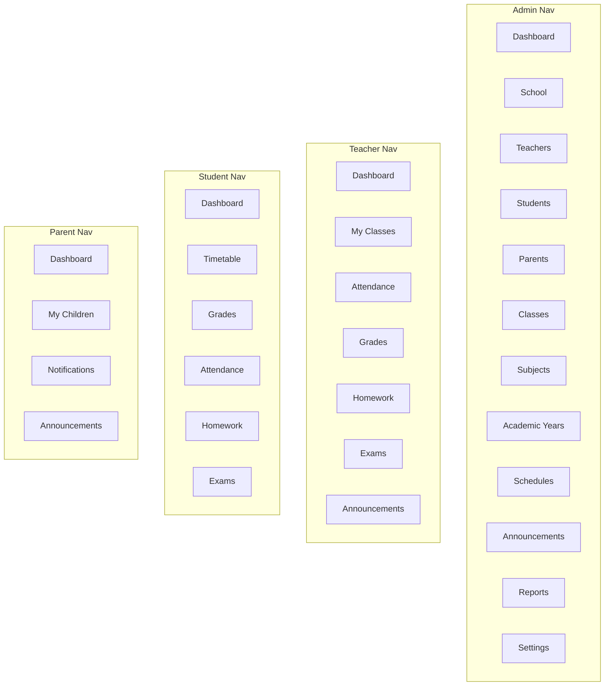

# Frontend Planning Schema

This document is the **planning view** of the LMS frontend. Use it to map features, routes, roles, and implementation order before writing code.

Reference: [v2/SAD.md](./v2/SAD.md) for full system architecture (v2.0). Legacy: [SAD.md](./SAD.md).

---

## 0. Conventions (Quick Reference)

| Rule | Decision |
|------|----------|
| UI library | HeroUI v3 only — use primitives directly in features |
| `components/` | Composites only — grouped in domain subfolders (see §3) |
| Component folders | `components/<domain>/` for shared UI; `features/<name>/components/<domain>/` for feature-only UI |
| `layout/` | Dashboard chrome only: `sidebar/Sidebar.tsx`, `top-bar/TopBar.tsx` |
| Route layouts | Defined in `app/auth/layout.tsx` and `app/(dashboard)/layout.tsx` — no wrapper layout components |
| Root `/` redirect | Handled in `proxy.ts` by role — no `app/page.tsx` |
| Auth URLs | Real path segment `app/auth/` → `/auth/login`, `/auth/forgot-password`, etc. |
| `providers/` | React context at `src/providers/` — not under `components/` |
| Feature code | Domain logic in `src/features/<name>/` — compose in `app/**/page.tsx`, no `<Feature>Page` wrappers |
| Auth / API | `lib/auth/`, `lib/api/` — not in `components/` |
| Indentation | 4 spaces |
| JSX wrappers | Prefer a single `<div>` or semantic element — avoid `<>...</>` when multiple siblings |

**Forbidden:** `AppShell`, `AuthLayout`, `DashboardLayout`, `<Feature>Page` wrappers, loose files in `components/` (always use domain subfolders), custom HeroUI replacements.

---

## 1. Application Layout

```
┌─────────────────────────────────────────────────────────────────────────┐
│  app/layout.tsx (Root)                                                   │
│  ├── providers/ — Theme, i18n, Auth                                     │
│  └── children                                                            │
│       │                                                                  │
│       ├── auth/layout.tsx                                               │
│       │    ├── login/page.tsx              → /auth/login                  │
│       │    ├── forgot-password/page.tsx    → /auth/forgot-password        │
│       │    ├── reset-password/[token]/page.tsx → /auth/reset-password/:token │
│       │    ├── verify-email/[token]/page.tsx   → /auth/verify-email/:token   │
│       │    └── invite/[token]/page.tsx       → /auth/invite/:token        │
│       │                                                                  │
│       └── (dashboard)/layout.tsx — composes Sidebar + TopBar inline      │
│            ├── Sidebar (role-based nav)                                  │
│            ├── TopBar (user menu, notifications, locale, theme)          │
│            └── {children}                                                │
└─────────────────────────────────────────────────────────────────────────┘
```

### Root folder structure

```
src/
├── proxy.ts                                # Auth, role guards, `/` redirect by role (Next.js 16+)
├── app/                                    # Next.js App Router (routes + layouts only)
│   ├── layout.tsx                          # Root: wraps providers/, html/body
│   ├── auth/                               # Public auth routes → /auth/*
│   │   ├── layout.tsx                      # Auth layout — inline here, not in layout/
│   │   ├── login/
│   │   │   └── page.tsx                    # /auth/login
│   │   ├── forgot-password/
│   │   │   └── page.tsx                    # /auth/forgot-password
│   │   ├── reset-password/
│   │   │   └── [token]/
│   │   │       └── page.tsx                # /auth/reset-password/:token
│   │   ├── verify-email/
│   │   │   └── [token]/
│   │   │       └── page.tsx                # /auth/verify-email/:token
│   │   └── invite/
│   │       └── [token]/
│   │           └── page.tsx                # /auth/invite/:token
│   ├── (dashboard)/                        # Authenticated routes
│   │   ├── layout.tsx                      # Composes Sidebar + TopBar inline
│   │   ├── admin/
│   │   │   ├── page.tsx
│   │   │   ├── school/
│   │   │   ├── teachers/
│   │   │   ├── students/
│   │   │   ├── parents/
│   │   │   ├── classes/
│   │   │   ├── subjects/
│   │   │   ├── departments/
│   │   │   ├── academic-years/
│   │   │   ├── schedules/
│   │   │   ├── announcements/
│   │   │   ├── reports/
│   │   │   ├── users/
│   │   │   ├── settings/
│   │   │   └── audit-logs/
│   │   ├── teacher/
│   │   │   ├── page.tsx
│   │   │   ├── classes/[id]/
│   │   │   ├── attendance/
│   │   │   ├── grades/
│   │   │   ├── homework/
│   │   │   ├── exams/
│   │   │   ├── lessons/
│   │   │   ├── announcements/
│   │   │   └── reports/
│   │   ├── student/
│   │   │   ├── page.tsx
│   │   │   ├── timetable/
│   │   │   ├── grades/
│   │   │   ├── attendance/
│   │   │   ├── homework/
│   │   │   ├── exams/
│   │   │   └── announcements/
│   │   ├── parent/
│   │   │   ├── page.tsx
│   │   │   ├── children/[id]/
│   │   │   │   ├── page.tsx
│   │   │   │   ├── grades/
│   │   │   │   ├── attendance/
│   │   │   │   └── homework/
│   │   │   ├── notifications/
│   │   │   └── announcements/
│   │   ├── profile/
│   │   ├── security/
│   │   ├── notifications/
│   │   ├── messages/
│   │   └── files/
│   └── api/
│       └── auth/
│           └── [...all]/
│               └── route.ts                # Better Auth handlers
├── actions/
│   └── auth/                               # Auth server actions (optional)
├── components/                             # Shared UI — grouped by domain folder
│   ├── attachments/
│   │   ├── AttachmentList.tsx
│   │   ├── AttachmentSection.tsx
│   │   └── AttachmentUploader.tsx
│   ├── data-table/
│   │   └── DataTable.tsx
│   ├── page-header/
│   │   └── PageHeader.tsx
│   └── charts/
│       └── ChartCard.tsx
├── layout/                                 # Dashboard chrome — grouped by domain folder
│   ├── sidebar/
│   │   └── Sidebar.tsx
│   └── top-bar/
│       └── TopBar.tsx
├── providers/                              # React context providers
│   ├── ThemeProvider.tsx
│   ├── I18nProvider.tsx
│   └── AuthProvider.tsx
├── features/
│   ├── auth/                               # Public auth flows — see §1.1
│   │   ├── components/
│   │   │   ├── login/
│   │   │   │   └── LoginForm.tsx
│   │   │   ├── forgot-password/
│   │   │   │   └── ForgotPasswordForm.tsx
│   │   │   ├── reset-password/
│   │   │   │   └── ResetPasswordForm.tsx
│   │   │   ├── verify-email/
│   │   │   │   └── VerifyEmailStatus.tsx
│   │   │   └── invite/
│   │   │       └── InviteAcceptForm.tsx
│   │   ├── hooks/
│   │   │   ├── useLogin.ts
│   │   │   └── useLogout.ts
│   │   ├── schemas/
│   │   │   └── auth.schema.ts
│   │   ├── services/
│   │   │   └── auth.service.ts
│   │   └── types/
│   │       └── auth.types.ts
│   ├── security/                           # Authenticated security — see §1.1
│   │   ├── components/
│   │   │   ├── devices/
│   │   │   │   └── DeviceList.tsx
│   │   │   ├── password/
│   │   │   │   └── ChangePasswordForm.tsx
│   │   │   └── sessions/
│   │   │       └── LogoutAllButton.tsx
│   │   ├── hooks/
│   │   ├── schemas/
│   │   └── services/
│   ├── dashboard/
│   ├── school/
│   ├── teachers/
│   ├── students/
│   ├── parents/
│   ├── classes/
│   ├── subjects/
│   ├── departments/
│   ├── academic-years/
│   ├── schedules/
│   ├── attendance/
│   ├── grades/
│   ├── homework/
│   ├── exams/
│   ├── lessons/
│   ├── announcements/
│   ├── notifications/
│   ├── messages/
│   ├── files/
│   ├── reports/
│   ├── users/
│   ├── settings/
│   ├── profile/
│   └── audit-logs/
├── hooks/
├── i18n/
├── messages/
│   ├── en/
│   │   ├── auth.json
│   │   └── ...
│   └── uz/
├── lib/
│   ├── api/
│   │   ├── client.ts
│   │   └── interceptors.ts
│   ├── auth/                               # Auth infrastructure — see §1.1
│   │   ├── client.ts                       # Better Auth client
│   │   ├── session.ts                      # getSession (proxy + server)
│   │   ├── permissions.ts
│   │   ├── role-guard.tsx
│   │   └── role-home.ts                    # ROLE_HOME map for proxy.ts
│   ├── form/                               # RHF + Zod helpers (not UI components)
│   └── navigation/                         # Sidebar config per role (admin.ts, teacher.ts, …)
├── schemas/                                # Shared Zod schemas
├── services/                               # Cross-feature API services (optional)
├── styles/                                 # Global CSS, Tailwind
├── types/                                  # Shared TypeScript types
└── utils/                                  # Pure helpers, domain label/color maps
```

### 1.1 Auth module structure

Public auth (unauthenticated) and authenticated security are separate concerns.

```
Auth flow map
─────────────────────────────────────────────────────────────────
proxy.ts               → guards all routes, `/` redirect by role
app/api/auth/          → Better Auth route handlers
lib/auth/              → session, permissions, role-guard, role-home
providers/AuthProvider → client session context
features/auth/         → login, reset, verify, invite UI
features/security/     → password, devices, logout-all (dashboard)
app/auth/              → public auth routes at /auth/* (compose features/auth)
app/(dashboard)/security/ → authenticated security route
```

#### `app/auth/` — route → feature component

| Route | Page | Feature component |
|-------|------|-------------------|
| `/auth/login` | `auth/login/page.tsx` | `features/auth/components/login/LoginForm.tsx` |
| `/auth/forgot-password` | `auth/forgot-password/page.tsx` | `features/auth/components/forgot-password/ForgotPasswordForm.tsx` |
| `/auth/reset-password/[token]` | `auth/reset-password/[token]/page.tsx` | `features/auth/components/reset-password/ResetPasswordForm.tsx` |
| `/auth/verify-email/[token]` | `auth/verify-email/[token]/page.tsx` | `features/auth/components/verify-email/VerifyEmailStatus.tsx` |
| `/auth/invite/[token]` | `auth/invite/[token]/page.tsx` | `features/auth/components/invite/InviteAcceptForm.tsx` |

#### Login route example

```tsx
// app/auth/login/page.tsx  [Client — form interactivity]
import { LoginForm } from "@/features/auth/components/login/LoginForm";

export default function Page() {
    return <LoginForm />;
}
```

#### `features/security/` — authenticated account security

| Route | Feature component |
|-------|-------------------|
| `/security` | `DeviceList`, `ChangePasswordForm`, `LogoutAllButton` |

```tsx
// app/(dashboard)/security/page.tsx
import { PageHeader } from "@/components/page-header/PageHeader";
import { DeviceList } from "@/features/security/components/devices/DeviceList";
import { ChangePasswordForm } from "@/features/security/components/password/ChangePasswordForm";
import { LogoutAllButton } from "@/features/security/components/sessions/LogoutAllButton";

export default function Page() {
    return (
        <div className="space-y-6">
            <PageHeader title="Security" />
            <ChangePasswordForm />
            <DeviceList />
            <LogoutAllButton />
        </div>
    );
}
```

### Layout conventions

**Root layout** — wraps providers only:

```tsx
// app/layout.tsx
import { ThemeProvider } from "@/providers/ThemeProvider";
import { I18nProvider } from "@/providers/I18nProvider";
import { AuthProvider } from "@/providers/AuthProvider";

export default function RootLayout({ children }: { children: React.ReactNode }) {
    return (
        <html lang="en">
            <body>
                <ThemeProvider>
                    <I18nProvider>
                        <AuthProvider>{children}</AuthProvider>
                    </I18nProvider>
                </ThemeProvider>
            </body>
        </html>
    );
}
```

**Auth pages** — layout lives in the route file, not in `layout/`:

```tsx
// app/auth/layout.tsx
export default function Layout({ children }: { children: React.ReactNode }) {
    return (
        <div className="flex min-h-screen items-center justify-center">
            <div className="w-full max-w-md">{children}</div>
        </div>
    );
}
```

**Dashboard pages** — `(dashboard)/layout.tsx` composes layout pieces directly:

```tsx
// app/(dashboard)/layout.tsx
import { Sidebar } from "@/layout/sidebar/Sidebar";
import { TopBar } from "@/layout/top-bar/TopBar";

export default function Layout({ children }: { children: React.ReactNode }) {
    return (
        <div className="flex min-h-screen">
            <Sidebar />
            
            <div className="flex flex-1 flex-col">
                <TopBar />
                <main className="flex-1 p-6">{children}</main>
            </div>
        </div>
    );
}
```

---

## 2. Route Map by Role

Legend: `[S]` Server Component default · `[C]` Client Component · `[SC]` Server + Client islands

### 2.1 Public / Auth — `app/auth/`

| Route | Page | Component type | Feature component | API |
|-------|------|----------------|-------------------|-----|
| `/auth/login` | `auth/login/page.tsx` | `[C]` | `LoginForm` | `POST /auth/login` |
| `/auth/forgot-password` | `auth/forgot-password/page.tsx` | `[C]` | `ForgotPasswordForm` | `POST /auth/password` |
| `/auth/reset-password/[token]` | `auth/reset-password/[token]/page.tsx` | `[C]` | `ResetPasswordForm` | `PATCH /auth/password` |
| `/auth/verify-email/[token]` | `auth/verify-email/[token]/page.tsx` | `[S]` | `VerifyEmailStatus` | `GET /auth/confirmation` |
| `/auth/invite/[token]` | `auth/invite/[token]/page.tsx` | `[C]` | `InviteAcceptForm` | `POST /auth/invite` |

See **§1.1** for full auth folder structure.

### 2.2 Admin (School Director) — `(dashboard)/admin/`

| Route | Feature module | Key pages | API dependencies |
|-------|----------------|-----------|------------------|
| `/admin` | `features/dashboard` | Overview KPIs, charts | `/analytics/overview` |
| `/admin/school` | `features/school` | Settings, branding, academic config | `/school`, `/settings` |
| `/admin/teachers` | `features/teachers` | List, create, edit, assign subjects | `/teachers` |
| `/admin/students` | `features/students` | List, enroll, transfer, profile | `/students`, `/enrollments` |
| `/admin/parents` | `features/parents` | List, link children | `/parents` |
| `/admin/classes` | `features/classes` | Classes, sections, rosters | `/classes`, `/sections` |
| `/admin/subjects` | `features/subjects` | Subject catalog | `/subjects` |
| `/admin/departments` | `features/departments` | Department tree | `/departments` |
| `/admin/academic-years` | `features/academic-years` | Years, semesters | `/academic_years`, `/semesters` |
| `/admin/schedules` | `features/schedules` | Timetable builder | `/schedules`, `/lessons` |
| `/admin/announcements` | `features/announcements` | School-wide announcements | `/announcements` |
| `/admin/reports` | `features/reports` | Export, PDF/CSV | `/reports` |
| `/admin/users` | `features/users` | Staff accounts, roles | `/users`, `/roles` |
| `/admin/settings` | `features/settings` | Permissions, notifications, integrations | `/settings` |
| `/admin/audit-logs` | `features/audit-logs` | Compliance audit trail | `/audit_logs` |

### 2.3 Teacher — `(dashboard)/teacher/`

| Route | Feature module | Key pages | API dependencies |
|-------|----------------|-----------|------------------|
| `/teacher` | `features/dashboard` | My classes today, pending tasks | `/analytics/teacher` |
| `/teacher/classes` | `features/classes` | Assigned classes list | `/classes?teacher_id=me` |
| `/teacher/classes/[id]` | `features/classes` | Class detail, roster | `/classes/:id`, `/students` |
| `/teacher/attendance` | `features/attendance` | Take attendance by class/date | `/attendance_records` |
| `/teacher/grades` | `features/grades` | Gradebook per class/subject | `/grades` |
| `/teacher/homework` | `features/homework` | Create, assign, review | `/homework`, `/assignments` |
| `/teacher/exams` | `features/exams` | Exam schedule, results | `/exams` |
| `/teacher/lessons` | `features/lessons` | Lesson plans | `/lessons` |
| `/teacher/announcements` | `features/announcements` | Class announcements | `/announcements` |
| `/teacher/reports` | `features/reports` | Class performance | `/reports/class` |

### 2.4 Student — `(dashboard)/student/`

| Route | Feature module | Key pages | API dependencies |
|-------|----------------|-----------|------------------|
| `/student` | `features/dashboard` | Today schedule, recent grades | `/analytics/student` |
| `/student/timetable` | `features/schedules` | Weekly timetable | `/schedules/me` |
| `/student/grades` | `features/grades` | Grades by subject/semester | `/grades/me` |
| `/student/attendance` | `features/attendance` | Attendance history | `/attendance_records/me` |
| `/student/homework` | `features/homework` | Assigned homework | `/assignments/me` |
| `/student/exams` | `features/exams` | Upcoming exams | `/exams/me` |
| `/student/announcements` | `features/announcements` | Feed | `/announcements/me` |

### 2.5 Parent — `(dashboard)/parent/`

| Route | Feature module | Key pages | API dependencies |
|-------|----------------|-----------|------------------|
| `/parent` | `features/dashboard` | Children overview | `/analytics/parent` |
| `/parent/children/[id]` | `features/students` | Child profile hub | `/students/:id` (scoped) |
| `/parent/children/[id]/grades` | `features/grades` | Child grades | `/grades?student_id=` |
| `/parent/children/[id]/attendance` | `features/attendance` | Child attendance | `/attendance_records?student_id=` |
| `/parent/children/[id]/homework` | `features/homework` | Child homework | `/assignments?student_id=` |
| `/parent/notifications` | `features/notifications` | Alerts, preferences | `/notifications` |
| `/parent/announcements` | `features/announcements` | School feed | `/announcements/me` |

### 2.6 Shared authenticated — `(dashboard)/`

| Route | Feature module | Purpose |
|-------|----------------|---------|
| `/profile` | `features/profile` | Edit profile, avatar |
| `/security` | `features/security` | Password, devices, logout all — see §1.1 |
| `/notifications` | `features/notifications` | In-app notification center |
| `/messages` | `features/messages` | Direct messaging |
| `/files` | `features/files` | File manager — uses `components/attachments/` |

---

## 3. Feature Module Template

Every feature under `src/features/<name>/` follows this structure. Use HeroUI primitives directly inside components — do not re-export or wrap them.

### Component folder rule

**Shared UI** (used across features) → `components/<domain>/`:

```
components/attachments/
├── AttachmentList.tsx
├── AttachmentSection.tsx
└── AttachmentUploader.tsx
```

**Feature-only UI** → `features/<name>/components/<domain>/`:

```
features/students/components/students/
├── StudentList.tsx
├── StudentForm.tsx
├── StudentDetail.tsx
└── StudentFilters.tsx
```

Never place loose `.tsx` files directly under `components/` — always use a domain subfolder.

### Full feature structure

```
features/<name>/
├── components/
│   └── <domain>/
│       ├── <Domain>List.tsx
│       ├── <Domain>Form.tsx
│       ├── <Domain>Detail.tsx
│       └── <Domain>Filters.tsx
├── hooks/
│   ├── use<Name>.ts
│   └── use<Name>Query.ts
├── schemas/
│   └── <name>.schema.ts
├── types/
│   └── <name>.types.ts
├── services/
│   └── <name>.service.ts
├── constants/
│   └── <name>.constants.ts
└── index.ts
```

Do **not** create `<Name>Page.tsx` — the Next.js route file composes feature components directly.

```tsx
// app/(dashboard)/admin/students/page.tsx  [Server Component]
import { PageHeader } from "@/components/page-header/PageHeader";
import { StudentList } from "@/features/students/components/students/StudentList";
import { StudentFilters } from "@/features/students/components/students/StudentFilters";
import { getStudents } from "@/features/students/services/students.service";

export default async function Page() {
    const { data: students } = await getStudents();

    return (
        <div className="space-y-6">
            <PageHeader title="Students" />
            <StudentFilters />
            <StudentList students={students} />
        </div>
    );
}
```

---

## 4. Data Flow Layers

```
┌──────────────┐     ┌──────────────┐     ┌──────────────┐     ┌──────────────┐
│   Page [S]   │────▶│ Feature UI   │────▶│ Hook [C]     │────▶│ Service      │
│  (app route) │     │ [S/C]        │     │ useMutation  │     │ Wretch client│
└──────────────┘     └──────────────┘     └──────────────┘     └──────┬───────┘
       │                    │                                         │
       │ fetch on server    │ form state (RHF)                        │
       ▼                    ▼                                         ▼
┌──────────────┐     ┌──────────────┐                          Rails API
│ Server Action│     │ Zod schema   │                          /api/v1/*
│ (optional)   │     │ validation   │
└──────────────┘     └──────────────┘
```

### Responsibility matrix

| Layer | Location | Responsibility |
|-------|----------|----------------|
| Proxy | `proxy.ts` | Auth guards, role routing, `/` → role dashboard redirect |
| Route / Layout | `app/` | URL, metadata, loading/error boundaries |
| Auth layout | `app/auth/layout.tsx` | Centered auth pages — inline markup only |
| Dashboard layout | `app/(dashboard)/layout.tsx` | Composes `Sidebar` + `TopBar` — no wrapper component |
| Page shell | `app/**/page.tsx` | Fetch data + compose feature components — no `<Feature>Page` wrapper |
| Dashboard chrome | `layout/<domain>/` | e.g. `layout/sidebar/Sidebar.tsx`, `layout/top-bar/TopBar.tsx` |
| Providers | `providers/` | Theme, i18n, auth session context |
| Composites | `components/<domain>/` | e.g. `components/attachments/AttachmentUploader.tsx` |
| Feature UI | `features/*/components/<domain>/` | e.g. `features/students/components/students/StudentList.tsx` |
| Hooks | `features/*/hooks/` or `hooks/` | Client state, mutations, optimistic updates |
| Schemas | `features/*/schemas/` or `schemas/` | Zod validation |
| Services | `features/*/services/` or `services/` | HTTP calls via Wretch |
| Actions | `actions/` | Server Actions + `revalidateTag` |
| Auth logic | `lib/auth/` | Client, permissions, role-guard |
| API client | `lib/api/` | Wretch instance, interceptors |
| Navigation | `lib/navigation/` | Sidebar items per role |
| Form helpers | `lib/form/` | RHF + Zod bindings (not UI) |
| Types | `types/` + `features/*/types/` | Shared and feature TS types |
| i18n | `i18n/` + `messages/` | Locale routing, translation keys |
| Utils | `utils/` | Pure helpers, status label/color maps |

---

## 5. Navigation Schema (Sidebar)



Navigation config: `src/lib/navigation/<role>.ts` — consumed by `layout/sidebar/Sidebar.tsx`.

---

## 6. Auth & Route Protection

All request routing — including `/` redirect by role — is handled in `proxy.ts`. Do **not** use `app/page.tsx` for landing or redirects.

```
Request
  │
  ▼
proxy.ts
  ├── GET / + no session        → redirect /auth/login
  ├── GET / + session           → redirect by role (/admin, /teacher, /student, /parent)
  ├── /auth/* routes            → pass (public)
  ├── Protected + no session    → redirect /auth/login
  ├── Protected + wrong role    → redirect /unauthorized
  └── Protected + valid role    → pass
        │
        ▼
  (dashboard)/layout.tsx [Server]
  ├── getSession() via Better Auth
  ├── Load user + school context
  └── compose Sidebar + TopBar + {children}
```

### `proxy.ts` — root redirect by role

```tsx
// proxy.ts
import { NextRequest, NextResponse } from "next/server";
import { getSession } from "@/lib/auth/session";

const ROLE_HOME: Record<string, string> = {
    admin: "/admin",
    teacher: "/teacher",
    student: "/student",
    parent: "/parent",
};

export async function proxy(request: NextRequest) {
    const { pathname } = request.nextUrl;
    const session = await getSession(request);

    if (pathname === "/") {
        if (!session) return NextResponse.redirect(new URL("/auth/login", request.url));
        const home = ROLE_HOME[session.user.role] ?? "/auth/login";
        return NextResponse.redirect(new URL(home, request.url));
    }

    // ... public route allowlist, protected route guards, role checks
}
```

| Concern | Where |
|---------|-------|
| Token storage | httpOnly cookie (refresh) + memory (access) |
| Route guard | `proxy.ts` + layout server checks |
| Root `/` redirect | `proxy.ts` only — no `app/page.tsx` |
| Role guard | `lib/auth/permissions.ts` + feature-level checks |
| Tenant context | `session.user.schoolId` — never from URL params |
| API auth | Wretch interceptor attaches Bearer access token |
| Token refresh | Silent refresh via Better Auth + `/api/v1/auth/refresh` |

---

## 7. Feature → API → Database Map

Use this table when planning sprints.

| Feature | Primary entities | Backend interactors | Phase |
|---------|-----------------|---------------------|-------|
| `auth` | User, RefreshToken, DeviceSession | AuthenticateUser, RefreshToken, RevokeSessions | 1 |
| `school` | School, Subscription | UpdateSchoolSettings | 2 |
| `users` | User, Role, Permission | InviteUser, AssignRole | 2 |
| `teachers` | Teacher, SubjectAssignment | CreateTeacher, AssignSubject | 3 |
| `students` | Student, Enrollment | EnrollStudent, TransferStudent | 3 |
| `parents` | Parent, ParentStudent | LinkParentChild | 3 |
| `classes` | Class, Section, Enrollment | CreateClass, AddToSection | 3 |
| `subjects` | Subject, Department | CreateSubject | 3 |
| `academic-years` | AcademicYear, Semester | ActivateAcademicYear | 3 |
| `schedules` | Schedule, Lesson | BuildTimetable | 4 |
| `attendance` | AttendanceRecord | RecordAttendance | 4 |
| `grades` | Grade | CreateGrade, UpdateGrade | 4 |
| `homework` | Homework, Assignment | AssignHomework | 4 |
| `exams` | Exam | ScheduleExam, RecordResults | 4 |
| `announcements` | Announcement | PublishAnnouncement | 5 |
| `notifications` | Notification | SendNotification | 5 |
| `messages` | Message | SendMessage | 5 |
| `files` | File, Attachment | UploadFile | 5 |
| `reports` | — (aggregations) | GenerateReport (job) | 5 |
| `analytics` | — (aggregations) | ComputeAnalytics (job) | 5 |
| `audit-logs` | AuditLog | — (write-only from backend) | 2 |

---

## 8. HeroUI vs Custom Components

HeroUI v3 is the **only** UI library. Import from `@heroui/react` everywhere UI is needed.

### Where does code go?

```
Need UI?
├── HeroUI has it (Button, Input, Modal, Table, Badge, Breadcrumbs, Card, …)
│   └── Use directly in features/*/components/<domain>/
├── Combines 3+ HeroUI parts + repeated across features
│   └── src/components/<domain>/     (e.g. attachments/AttachmentUploader.tsx)
├── Feature-specific screen logic
│   └── src/features/<name>/components/<domain>/   (e.g. students/StudentList.tsx)
├── Dashboard sidebar / header
│   └── src/layout/<domain>/         (e.g. sidebar/Sidebar.tsx)
├── Auth/session/theme context
│   └── src/providers/
└── Permissions, API, form bindings
    └── src/lib/
```

### Use HeroUI directly (do NOT wrap in `components/`)

| Need | Use from `@heroui/react` |
|------|--------------------------|
| Buttons, links | `Button` |
| Text inputs, search | `Input` |
| Selects, dropdowns | `Select`, `Dropdown` |
| Dialogs | `Modal` |
| Tables (simple) | `Table` |
| Badges, status chips | `Badge` |
| Date picking | `DatePicker` |
| Cards | `Card` |
| Breadcrumbs | `Breadcrumbs` |
| Pagination | `Pagination` |
| Progress, skeletons | `Progress`, `Skeleton` |
| Tabs, avatars, switches | `Tabs`, `Avatar`, `Switch`, etc. |

Import and compose these **inside feature or layout components** — no custom wrappers.

### Allowed in `components/<domain>/` (composites only)

Create a shared component **only** when it:

1. Combines **multiple** HeroUI components into a repeated app pattern, or
2. Adds **application-specific behavior** HeroUI does not provide

| Path | Why it exists | HeroUI building blocks |
|------|---------------|------------------------|
| `attachments/AttachmentUploader.tsx` | Presigned upload to R2/S3 — used in homework, profile, files | `Button`, `Progress` |
| `attachments/AttachmentList.tsx` | Reusable file list display | `Table`, `Button` |
| `attachments/AttachmentSection.tsx` | File section wrapper with upload + list | `Card` + attachments components |
| `data-table/DataTable.tsx` | List pages share pagination, sort, filter UX | `Table`, `Pagination`, `Dropdown`, `Skeleton` |
| `page-header/PageHeader.tsx` | Every page shares title + breadcrumb + actions | HeroUI `Breadcrumbs`, `Button` |
| `charts/ChartCard.tsx` | Dashboard charts share card shell + Recharts | `Card`, `Skeleton` + Recharts |

Add new shared composites only when the same pattern appears in **3+ features**.

### Not UI — do not put in `components/`

| Concern | Location |
|---------|----------|
| Role-based render guard | `lib/auth/role-guard.tsx` |
| RHF + Zod field binding helpers | `lib/form/` |
| Domain status → label/color maps | `utils/` or `features/*/constants/` |
| Empty states (simple) | Inline in feature using HeroUI `Card` |
| Delete confirmation | Inline HeroUI `Modal` in feature, or feature hook |

### Example — correct usage in a feature

```tsx
// features/students/components/students/StudentFilters.tsx
import { Input, Select, Button } from "@heroui/react";

export function StudentFilters() {
    return (
        <div className="flex gap-3">
            <Input placeholder="Search students..." />
            <Select>...</Select>
            <Button>Export</Button>
        </div>
    );
}
```

```tsx
// app/(dashboard)/admin/students/page.tsx
import { PageHeader } from "@/components/page-header/PageHeader";
import { DataTable } from "@/components/data-table/DataTable";
import { StudentFilters } from "@/features/students/components/students/StudentFilters";

export default async function Page() {
    const students = await fetchStudents();

    return (
        <div className="space-y-6">
            <PageHeader title="Students" />
            <StudentFilters />
            <DataTable columns={columns} data={students} />
        </div>
    );
}
```

```tsx
// components/attachments/AttachmentUploader.tsx
import { Button, Progress } from "@heroui/react";

export function AttachmentUploader() {
    // presigned upload logic
    return ( ... );
}
```

```tsx
// features/dashboard/components/overview/AdminOverview.tsx
import { Card, CardBody } from "@heroui/react";

export function AdminOverview({ stats }) {
    return (
        <div className="grid grid-cols-4 gap-4">
            {stats.map((stat) => (
                <Card key={stat.label}>
                    <CardBody>{stat.value}</CardBody>
                </Card>
            ))}
        </div>
    );
}
```

---

## 9. i18n Key Namespaces

```
messages/
├── en/
│   ├── common.json           # buttons, labels, errors
│   ├── auth.json
│   ├── admin.json
│   ├── teacher.json
│   ├── student.json
│   ├── parent.json
│   ├── students.json         # feature-specific
│   ├── grades.json
│   ├── attendance.json
│   └── ...
└── uz/                       # mirror structure
```

Pattern: `features/<feature>/components/<domain>/` uses `useTranslations("<feature>")`.

---

## 10. Implementation Planning Matrix

### Phase 1 — Foundation

| # | Route / Feature | Deliverables |
|---|----------------|--------------|
| 1.1 | Project scaffold | Next.js, HeroUI, Tailwind, ESLint, Prettier |
| 1.2 | `lib/auth`, `lib/api` | client, session, permissions, role-home, Wretch |
| 1.3 | `auth/*`, `features/auth` | LoginForm, ForgotPasswordForm, ResetPasswordForm, invite |
| 1.4 | `app/api/auth`, `providers/AuthProvider` | Better Auth handlers + session context |
| 1.5 | `(dashboard)/layout` | Sidebar, TopBar, role routing |
| 1.6 | `proxy.ts` | Auth, role guards, `/` redirect by role |
| 1.7 | `features/security`, `/security` | DeviceList, ChangePasswordForm, LogoutAllButton |

### Phase 2 — Admin core

| # | Route / Feature | Deliverables |
|---|----------------|--------------|
| 2.1 | `/admin` | Dashboard with HeroUI `Card` stats + `charts/ChartCard` |
| 2.2 | `/admin/school` | School settings form |
| 2.3 | `/admin/teachers` | CRUD + DataTable |
| 2.4 | `/admin/students` | CRUD + enrollment |
| 2.5 | `/admin/parents` | CRUD + child linking |
| 2.6 | `/admin/classes` | Classes + sections |
| 2.7 | `/admin/subjects` | Subject catalog |

### Phase 3 — Academic operations

| # | Route / Feature | Deliverables |
|---|----------------|--------------|
| 3.1 | `/teacher/attendance` | Attendance grid |
| 3.2 | `/teacher/grades` | Gradebook |
| 3.3 | `/admin/schedules` | Timetable builder |
| 3.4 | `/teacher/homework` | Assign homework |
| 3.5 | `/teacher/exams` | Exam management |

### Phase 4 — Student / Parent views

| # | Route / Feature | Deliverables |
|---|----------------|--------------|
| 4.1 | `/student/*` | Read-only student portal |
| 4.2 | `/parent/*` | Multi-child parent portal |
| 4.3 | `/notifications` | Notification center |

### Phase 5 — Reports & polish

| # | Route / Feature | Deliverables |
|---|----------------|--------------|
| 5.1 | `/admin/reports` | Export + async download |
| 5.2 | `/admin/analytics` | Recharts dashboards |
| 5.3 | Performance | Caching, optimistic UI, loading skeletons |

---

## 11. Page State Checklist (Every Route)

Each route folder under `app/` should include where applicable:

```
app/(dashboard)/admin/students/
├── page.tsx          # Server Component — imports from features/
├── loading.tsx       # HeroUI Skeleton (use directly, no wrapper)
├── error.tsx         # Error boundary with retry
└── not-found.tsx     # 404 within feature
```

---

## 12. TypeScript Domain Types (Frontend View)

Frontend types mirror API responses from Jbuilder. Example:

```typescript
// features/students/types/student.types.ts
export interface Student {
    id: string;
    schoolId: string;
    userId: string;
    firstName: string;
    lastName: string;
    email: string | null;
    classId: string | null;
    sectionId: string | null;
    enrollmentStatus: "active" | "transferred" | "graduated";
    createdAt: string;
    updatedAt: string;
}

export interface StudentListResponse {
    data: Student[];
    meta: PaginationMeta;
}

export interface PaginationMeta {
    page: number;
    limit: number;
    total: number;
    totalPages: number;
}
```

All list endpoints return `{ data: T[], meta: PaginationMeta }`.

---

## 13. Planning Workflow

When starting a new feature:

0. Read **§0 Conventions** — confirm no HeroUI wrappers or layout abstractions.
1. Pick row from **Section 7** (Feature → API → Database map).
2. Add routes to **Section 2** if missing.
3. Scaffold feature module per **Section 3** — use domain subfolders under `components/`.
4. Fill `.cursor/templates/feature.md` for the feature.
5. Implement backend first (API ready), then frontend pages.
6. Add i18n keys per **Section 9**.
7. Add E2E test for primary user journey.
