# Software Architecture Document (SAD) v2.0

**Product:** Tafakkur LMS — Multi-Tenant SaaS Learning Management System  
**Version:** 2.0  
**Date:** July 2026  
**Status:** Approved for implementation  

**Related documents:**

- [database-schema.md](./database-schema.md) — complete PostgreSQL table definitions
- [api-reference.md](./api-reference.md) — exhaustive REST API specification
- [operations.md](./operations.md) — Docker, CI/CD, production infrastructure, monitoring
- [frontend-schema.md](../frontend-schema.md) — frontend planning view (routes, features, phases)
- [SAD v1.0](../SAD.md) — prior architecture document (unchanged)

---

## Table of Contents

1. [Executive Summary](#1-executive-summary)
2. [Technology Decisions](#2-technology-decisions)
3. [High-Level Architecture](#3-high-level-architecture)
4. [Multi-Tenant Strategy](#4-multi-tenant-strategy)
5. [Database Design](#5-database-design)
6. [Frontend Architecture](#6-frontend-architecture)
7. [Backend Architecture](#7-backend-architecture)
8. [Authentication](#8-authentication)
9. [Authorization](#9-authorization)
10. [REST API Design](#10-rest-api-design)
11. [Background Jobs](#11-background-jobs)
12. [File Storage](#12-file-storage)
13. [Email Architecture](#13-email-architecture)
14. [Security](#14-security)
15. [Testing](#15-testing)
16. [Docker Setup](#16-docker-setup)
17. [CI/CD](#17-cicd)
18. [Production Infrastructure](#18-production-infrastructure)
19. [Monitoring](#19-monitoring)
20. [Performance Strategy](#20-performance-strategy)
21. [Mermaid Diagrams](#21-mermaid-diagrams)
22. [Development Roadmap](#22-development-roadmap)
23. [MVP Roadmap](#23-mvp-roadmap)
24. [Future Scaling Strategy](#24-future-scaling-strategy)

---

## 1. Executive Summary

Tafakkur LMS is an enterprise-grade, multi-tenant SaaS platform enabling schools to manage students, teachers, parents, academic operations, communication, and analytics. Each school operates as an isolated tenant sharing a common application stack while maintaining strict data boundaries.

### 1.1 Product Vision

The platform serves four user personas — Admin (school director), Teacher, Student, and Parent — across the full academic lifecycle: enrollment, scheduling, attendance, grading, homework, exams, announcements, notifications, reporting, and analytics.

### 1.2 Non-Functional Requirements

| Requirement | Target | Measurement |
|-------------|--------|-------------|
| Availability | 99.9% uptime | ~8.76 hours downtime/year |
| API latency | <200 ms p95 | Standard CRUD endpoints |
| Dashboard load | <2 s LCP | Admin/teacher dashboards |
| Scale | Thousands of schools, millions of users | Horizontal scaling |
| Security | OWASP Top 10, GDPR-ready | Penetration test + audit |
| Maintainability | SOLID, DRY, KISS, Clean Architecture | Code review gates |
| Observability | Structured logs, tracing, metrics | SLO dashboards |

### 1.3 Architecture Style

| Decision | Choice | Rationale |
|----------|--------|-----------|
| Application topology | Monolith-first Rails API + Next.js frontend | Time-to-market, operational simplicity |
| Multi-tenancy | Shared PostgreSQL + `school_id` column | Single migration pipeline, lowest ops cost |
| API style | Stateless REST `/api/v1` | Industry standard, easy client integration |
| Async processing | Sidekiq + Redis | Battle-tested Rails background jobs |
| File storage | Active Storage + R2/S3 | Direct upload, signed URLs |
| Auth model | Devise JWT (server) + Better Auth (client) | Secure token lifecycle with good DX |

### 1.4 Key Architectural Principles

1. **Tenant isolation is non-negotiable** — every query scoped by `school_id`; cross-tenant access is a security incident.
2. **Skinny controllers, fat interactors** — HTTP layer delegates to Interactor objects for business logic.
3. **Authorization at every boundary** — Pundit policies on every controller action; scopes on every list query.
4. **Server Components by default** — Next.js minimizes client JavaScript; Client Components only when interaction requires it.
5. **Convention over configuration** — Rails and Next.js conventions reduce decision fatigue.
6. **Defense in depth** — application scoping + database constraints + optional RLS + audit logs.

### 1.5 Document Suite Structure

This master SAD provides architecture, decisions, and rationale for all 24 deliverable sections. Exhaustive reference material lives in companion documents:

- **Database:** [database-schema.md](./database-schema.md) — every column, index, FK
- **API:** [api-reference.md](./api-reference.md) — every endpoint with examples
- **Operations:** [operations.md](./operations.md) — Docker, CI/CD, production, monitoring

---

## 2. Technology Decisions

Each technology choice follows the ADR format: **Why chosen**, **Advantages**, **Disadvantages**, **Alternatives**, **Why alternatives rejected**.

### 2.1 Decision Summary

| Technology | Role | Primary reason |
|------------|------|----------------|
| Ruby on Rails (API-only) | Backend framework | Domain-rich LMS, mature ecosystem, rapid iteration |
| Next.js (App Router) | Frontend framework | RSC, middleware auth, Vercel deployment |
| React 19 | UI library | Concurrent features, ecosystem |
| TypeScript | Frontend language | Type safety, developer experience |
| HeroUI 3.2.2 | UI components | Accessible primitives, Tailwind v4 native |
| Tailwind CSS v4 | Styling | Utility-first, design tokens |
| Wretch | HTTP client | Lightweight fetch wrapper, JWT interceptors |
| React Hook Form + Zod | Forms/validation | Performant forms, schema validation |
| next-intl | Internationalization | Locale routing, message catalogs |
| next-themes | Theming | Dark/light mode |
| Better Auth | Frontend auth client | Session UX, cookie handling |
| Recharts | Charts | Dashboard visualizations |
| PostgreSQL 16 | Primary database | ACID, JSONB, partial indexes, RLS option |
| Redis 7 | Cache + queue | Sub-ms reads, Sidekiq backend |
| Sidekiq | Background jobs | Retry, dead queue, scheduling |
| Devise + Devise JWT | Backend auth | Standard Rails auth with JWT dispatch |
| Pundit | Authorization | Explicit policy objects, testable RBAC |
| Interactor | Business logic | Transaction boundaries, organizers |
| Versionist | API versioning | Clean `/api/v1` routing |
| Jbuilder | JSON serialization | Declarative views, no heavy serializer gem |
| Active Storage | File uploads | Rails-native, direct upload |
| Resend | Transactional email | Developer experience, deliverability |
| RSpec + FactoryBot | Backend testing | Rails standard |
| Jest + RTL + Playwright | Frontend testing | Unit + E2E |
| Docker | Containerization | Reproducible dev/prod |
| Sentry + OpenTelemetry | Observability | Errors + distributed tracing |

### 2.2 Rails API

**Why chosen:** The LMS domain is relationally rich (enrollments, grades, attendance, schedules). Active Record maps naturally to these entities. Rails conventions (migrations, routing, Active Record validations) accelerate development. The Ruby ecosystem provides mature gems for every cross-cutting concern (Devise, Pundit, Sidekiq, Active Storage).

**Advantages:**

- Convention over configuration reduces boilerplate
- Active Record migrations provide versioned schema evolution
- Mature gem ecosystem for auth, authorization, jobs, storage, email
- Interactor + Pundit patterns are well-established in production Rails apps
- Single deployable unit simplifies operations at current scale
- Strong hiring pool and documentation

**Disadvantages:**

- Ruby GIL limits single-process CPU parallelism (mitigated by Puma multi-worker + horizontal scaling)
- Not ideal for sub-10 ms latency at massive scale without optimization
- Monolith can grow large; requires discipline to maintain boundaries

**Alternatives considered:**

| Alternative | Why rejected |
|-------------|--------------|
| NestJS (TypeScript) | Team Ruby expertise; would duplicate domain logic patterns |
| Go microservices | Premature complexity; operational overhead for small team |
| Elixir/Phoenix | Smaller hiring pool; less mature LMS-specific ecosystem |
| Supabase-only | Insufficient custom business logic layer for complex grading/attendance rules |
| Django REST | Comparable but team prefers Rails conventions |

**Best fit:** Rails API-only mode provides exactly what an LMS needs — robust ORM, background jobs, file storage, email — without the overhead of frontend asset pipeline (handled by Next.js).

### 2.3 Next.js

**Why chosen:** App Router with Server Components reduces client JavaScript bundle size. Middleware/proxy enables auth guards before page render. Integrates natively with Vercel CDN for global edge deployment. Strong TypeScript ecosystem.

**Advantages:**

- Server Components fetch data on server — faster initial load, better SEO
- `proxy.ts` (Next.js 16+) handles role-based routing and auth guards
- Built-in image optimization, code splitting, streaming
- `next-intl` integrates cleanly with App Router locale segments
- Vercel deployment with zero-config CDN

**Disadvantages:**

- Framework complexity — Server/Client boundary requires discipline
- RSC caching semantics can be subtle
- Vendor coupling if deployed exclusively on Vercel (mitigated by Docker option)

**Alternatives rejected:**

| Alternative | Why rejected |
|-------------|--------------|
| Remix | Smaller HeroUI ecosystem; less RSC support |
| CRA / SPA-only | Worse initial load, no SSR, no middleware |
| Nuxt (Vue) | Team React expertise; smaller component library fit |
| SvelteKit | Smaller ecosystem for enterprise LMS |

### 2.4 HeroUI 3.2.2

**Why chosen:** Project standard UI library. Built on React Aria primitives for accessibility. Native Tailwind CSS v4 integration. No provider wrapper required in v3.

**Advantages:**

- Consistent design system across all features
- Accessible by default (focus management, ARIA labels, keyboard navigation)
- Reduced custom CSS — components ship with sensible defaults
- Active development aligned with React 19

**Disadvantages:**

- Vendor lock-in to component API
- Major version upgrades require migration effort
- Less customization freedom than headless + custom CSS

**Alternatives rejected:** shadcn/ui (more assembly required per component), MUI (heavier bundle, Material Design aesthetic mismatch), Chakra UI (smaller v3 ecosystem).

**Rule:** Never create custom replacements for Button, Input, Select, Modal, Drawer, Dropdown, Table, Tabs, Checkbox, Radio, Switch, Avatar, Badge, Breadcrumbs.

### 2.5 Wretch

**Why chosen:** Minimal API surface compared to Axios. Works with native `fetch`. Easy to compose interceptors for JWT refresh and error parsing.

**Advantages:**

- Tree-shakeable, no XMLHttpRequest legacy
- TypeScript-friendly chaining API
- Credentials/cookie support for refresh token flow
- Small bundle footprint

**Disadvantages:**

- Less built-in than Axios (retry, upload progress need custom middleware)
- Smaller community

**Alternatives rejected:** Axios (heavier, XMLHttpRequest-based), tRPC (backend is REST Rails, not RPC), ky (less middleware composition).

### 2.6 Better Auth

**Why chosen:** Modern Next.js auth client library. Handles session state, cookie management, and client-side auth UX. Complements Rails as the credential source of truth.

**Advantages:**

- Good developer experience for App Router
- Extensible plugin architecture
- Handles httpOnly cookie coordination with Rails refresh tokens

**Disadvantages:**

- Two auth layers (Better Auth client + Devise JWT server) require clear integration contract
- Additional abstraction over raw token management

**Alternatives rejected:**

| Alternative | Why rejected |
|-------------|--------------|
| NextAuth alone | Rails is source of truth for credentials and RBAC |
| Custom auth | Security risk; reinventing token rotation |
| Clerk/Auth0 | External dependency; cost at scale; less control over tenant model |

**Integration pattern:** Better Auth manages frontend session state. Rails issues JWT access + refresh tokens. Next.js `/api/auth/*` route proxies token refresh to Rails. Access token stored in memory; refresh token in httpOnly Secure SameSite cookie.

### 2.7 PostgreSQL

**Why chosen:** Relational integrity is critical for grades, enrollments, attendance, and schedules. Excellent indexing (partial, composite, GIN for JSONB). Optional Row-Level Security for defense-in-depth tenant isolation.

**Advantages:**

- Foreign key constraints enforce referential integrity
- Partial indexes (`WHERE discarded_at IS NULL`) optimize soft-delete queries
- JSONB for flexible school settings without schema migrations
- `pg_trgm` extension for fuzzy search
- Managed options (RDS, Supabase, Neon) with automated backups
- Read replicas for analytics offload

**Disadvantages:**

- Vertical scaling limits on single instance
- Complex sharding if single database exceeds ~10 TB
- Connection pool management required at scale (PgBouncer)

**Alternatives rejected:** MySQL (weaker JSON/index features), MongoDB (relational LMS data ill-fit), SQLite (not suitable for multi-tenant production).

### 2.8 Redis

**Why chosen:** Sub-millisecond reads for caching, rate limiting counters, and Sidekiq job queue backend.

**Advantages:**

- In-memory speed for hot data (school settings, dashboard aggregates)
- Pub/sub capability for future real-time notifications
- Atomic operations for rate limiting (Rack::Attack)
- Proven Sidekiq integration

**Disadvantages:**

- Additional service to operate and monitor
- Persistence configuration needed (AOF/RDB)
- Memory cost scales with cache size

**Alternatives rejected:** Memcached (no persistence, no pub/sub), database-only caching (too slow for rate limits and job queues).

### 2.9 Sidekiq

**Why chosen:** Industry-standard Rails background job processor. Built-in retry with exponential backoff, dead letter queue, and web UI.

**Advantages:**

- Mature ecosystem (sidekiq-cron, sidekiq-unique-jobs)
- Horizontal scaling by adding worker processes
- Queue prioritization (critical, default, mailers, reports, low)
- Proven at scale in production Rails apps

**Disadvantages:**

- Ruby process memory footprint
- Not suitable for long-running streaming jobs
- Requires Redis dependency

**Alternatives rejected:** Solid Queue (newer, less ecosystem tooling), Good Job (PostgreSQL-backed, adds DB load), Celery (wrong language), AWS SQS + custom workers (more infrastructure).

### 2.10 Devise + Devise JWT

**Why chosen:** De facto Rails authentication solution. Devise JWT adds JWT dispatch and denylist revocation on top of Devise's password hashing, recoverable, and confirmable modules.

**Advantages:**

- bcrypt password hashing (cost factor 12+)
- Battle-tested against common auth vulnerabilities
- JWT dispatch on login; denylist on logout
- Extensive documentation and community

**Disadvantages:**

- JWT in headers requires refresh token rotation for security
- Devise configuration can be complex
- Not OAuth/OIDC out of the box (can add later)

**Alternatives rejected:** Custom JWT implementation (security risk), Auth0 (external cost), rodauth (less ecosystem integration with Rails API patterns).

### 2.11 Pundit

**Why chosen:** Explicit `Policy` class per model with `Scope` for tenant + role filtering. Integrates with `authorize` in controllers.

**Advantages:**

- Testable — each policy action is a method with clear rules
- Readable — authorization logic is not hidden in magic
- Scope objects prevent data leaks in list endpoints
- Integrates naturally with multi-tenant `school_id` scoping

**Disadvantages:**

- Boilerplate — one policy file per resource
- Must be disciplined about calling `authorize` on every action

**Alternatives rejected:** CanCanCan (magic abilities harder to audit), Rolify-only (no resource-level policies), manual if/else in controllers (unmaintainable).

### 2.12 Interactor

**Why chosen:** Organizes business logic in composable context objects with explicit success/failure and transaction rollback.

**Advantages:**

- Transaction boundaries are explicit
- `Interactor::Organizer` chains multi-step flows (enroll student → notify parent)
- Testable in isolation without HTTP layer
- `context.fail!` rolls back database transaction

**Disadvantages:**

- Extra indirection vs plain service objects
- Learning curve for organizer patterns

**Alternatives rejected:** Fat models (unmaintainable at LMS complexity), dry-transaction (heavier DSL), plain service classes without rollback convention.

### 2.13 Versionist

**Why chosen:** Clean API versioning via module namespacing. Routes mounted at `/api/v1` with `V1::` controller namespace.

**Advantages:**

- v1 and v2 can coexist during migration periods
- Header or path-based versioning options
- Minimal configuration

**Disadvantages:**

- Another gem dependency
- Controllers duplicated across versions during transition

**Alternatives rejected:** Manual namespace routing (error-prone), no versioning (breaking changes harm clients).

### 2.14 Jbuilder

**Why chosen:** Declarative JSON view templates co-located with controllers. No heavy serializer gem dependency.

**Advantages:**

- Partial templates (`_student.json.jbuilder`) for DRY serialization
- Easy to customize per-action response shape
- No additional object allocation layer

**Disadvantages:**

- View templates can grow large for complex nested responses
- No automatic schema generation (use rswag separately)

**Alternatives rejected:** ActiveModel::Serializers (heavier, opinionated), jsonapi-serializer (JSON:API format not needed), manual `render json:` (unmaintainable).

### 2.15 Active Storage

**Why chosen:** Rails-native file upload framework with direct upload to S3/R2, variant processing, and signed URL generation.

**Advantages:**

- Integrated with Active Record models via `has_one_attached` / `has_many_attached`
- Direct upload bypasses Rails server for large files
- Signed URLs for private file access
- Blob deduplication via checksum

**Disadvantages:**

- Less feature-rich than dedicated DAM systems
- Virus scanning requires custom Sidekiq job
- No built-in CDN integration (configure separately)

**Alternatives rejected:** CarrierWave (older, less Rails 7+ integration), Shrine (more setup), direct S3 SDK (reinventing upload flow).

### 2.16 Resend

**Why chosen:** Modern transactional email API with excellent developer experience and deliverability.

**Advantages:**

- Simple REST API integration with Action Mailer
- React Email template support
- Webhooks for bounce/complaint handling
- Good free tier for development

**Disadvantages:**

- Vendor dependency
- High volume may need dedicated ESP or SES

**Alternatives rejected:** SendGrid (complex pricing), AWS SES (more setup, less DX), Mailgun (comparable but Resend DX preferred).

### 2.17 Docker

**Why chosen:** Reproducible development and production environments. Consistent dependency versions across team members and CI.

**Advantages:**

- `docker-compose up` starts entire stack locally
- Multi-stage builds for optimized production images
- Same image runs in dev, CI, and production

**Disadvantages:**

- Learning curve for team members new to containers
- macOS Docker performance overhead (mitigated by volume caching)

---

## 3. High-Level Architecture

### 3.1 System Context

Tafakkur LMS is a multi-tenant SaaS platform accessed via web browsers. Schools (tenants) onboard through an admin portal. Users authenticate with email/password and access role-specific dashboards. The system integrates with external services for email delivery, object storage, and observability.

### 3.2 Component Diagram

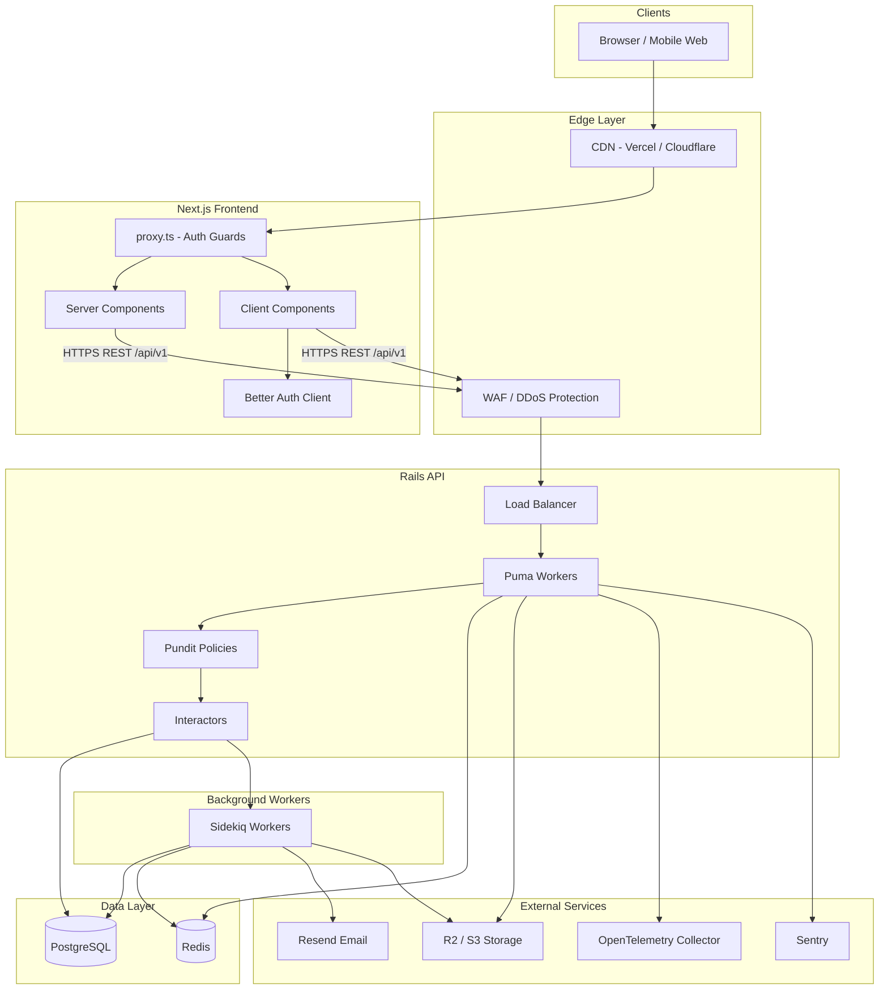

### 3.3 Component Responsibilities

| Component | Responsibility | Technology |
|-----------|---------------|------------|
| CDN | Static asset delivery, edge caching, DDoS protection | Vercel / Cloudflare |
| Next.js Frontend | UI rendering, routing, i18n, client auth session, server data prefetch | Next.js 15+, React 19 |
| proxy.ts | Auth guards, role-based `/` redirect, locale detection | Next.js middleware |
| Rails API | Authentication, authorization, business logic, persistence | Rails 8 API-only |
| PostgreSQL | System of record, constraints, indexes, transactions | PostgreSQL 16 |
| Redis | Cache, rate limits, session denylist, job queues | Redis 7 |
| Sidekiq | Email, notifications, reports, exports, cleanup, analytics | Sidekiq 7 |
| R2/S3 | Private/public file blob storage | Cloudflare R2 or AWS S3 |
| Resend | Transactional email delivery | Resend API |
| Sentry | Error tracking and alerting | Sentry SDK |
| OpenTelemetry | Distributed tracing and metrics export | OTel Collector |

### 3.4 Request Flow (Read Operation)

1. Browser requests dashboard page
2. CDN serves static assets; dynamic request hits Next.js
3. `proxy.ts` validates session cookie / redirects to `/auth/login`
4. Server Component fetches data from Rails API with Bearer access token
5. Rails authenticates JWT via Devise JWT
6. Controller sets `Current.school` from JWT `school_id` claim
7. Pundit `policy_scope` filters records by tenant + role
8. Interactor or query object fetches data with eager loading
9. Jbuilder renders JSON response
10. Server Component renders HTML with data; streams to browser

### 3.5 Request Flow (Write Operation)

1. Client Component submits form (React Hook Form + Zod validation)
2. Server Action or client service calls Rails API with Bearer token
3. Rails authenticates and authorizes via Pundit
4. Controller delegates to Interactor
5. Interactor wraps operation in `ActiveRecord::Base.transaction`
6. Model validations run (Active Record — no separate validator classes)
7. On success: enqueue Sidekiq jobs (notifications, emails), render JSON
8. On failure: rollback transaction, return 422 with field errors
9. Frontend displays toast or inline errors; revalidates cache tags

### 3.6 Deployment Topology

| Environment | Frontend | Backend | Database | Cache |
|-------------|----------|---------|----------|-------|
| Development | `localhost:3000` (Docker) | `localhost:3001` (Docker) | PostgreSQL (Docker) | Redis (Docker) |
| Staging | Vercel preview | ECS Fargate (1 task) | RDS (small) | ElastiCache (small) |
| Production | Vercel production | ECS Fargate (2+ tasks, multi-AZ) | RDS Multi-AZ | ElastiCache cluster |

---

## 4. Multi-Tenant Strategy

### 4.1 Requirement

Each school is an independent tenant owning its users, academic data, files, and settings. Tenant data must **never** be accessible by another tenant. The system must support thousands of schools and millions of users.

### 4.2 Approach Comparison

#### Option 1: Database per Tenant

Each school gets a dedicated PostgreSQL database.

| Criterion | Assessment |
|-----------|------------|
| Data isolation | Strongest — physical separation |
| Migration complexity | O(tenants) — must run migrations on every database |
| Infrastructure cost | Highest — one DB instance per school (or shared instance with many DBs) |
| Connection pooling | Complex — dynamic connection switching per request |
| Cross-tenant analytics | Hard — requires federated queries across databases |
| Backup/restore per tenant | Native — simple per-DB backup |
| Performance | Excellent per-tenant (no noisy neighbor) |
| Onboarding new tenant | Slow — provision new database |
| Compliance (data residency) | Easy — place DB in required region |

**Best for:** Enterprise customers requiring physical isolation; regulatory requirements mandating separate databases.

#### Option 2: PostgreSQL Schema per Tenant

Single database; each school gets a dedicated PostgreSQL schema (`school_abc`, `school_xyz`).

| Criterion | Assessment |
|-----------|------------|
| Data isolation | Strong — schema-level separation |
| Migration complexity | O(tenants) — `schema:load` or migrate each schema |
| Infrastructure cost | High — single DB but schema management overhead |
| Connection pooling | Moderate — `SET search_path` per request |
| Cross-tenant analytics | Hard — requires cross-schema queries |
| Backup/restore per tenant | Moderate — schema-level pg_dump |
| Performance | Good — shared connection pool, but large schema count degrades catalog performance |
| Onboarding new tenant | Moderate — create schema + run migrations |
| Compliance | Moderate — logical separation, shared infrastructure |

**Best for:** Medium tenant count (<500) with strong isolation requirements and manageable schema operations.

#### Option 3: Shared Database + `school_id` Column (CHOSEN)

Single PostgreSQL database; every tenant-owned row includes `school_id UUID NOT NULL`.

| Criterion | Assessment |
|-----------|------------|
| Data isolation | Good — application scoping + FK constraints + optional RLS |
| Migration complexity | O(1) — single migration pipeline |
| Infrastructure cost | Lowest — one database serves all tenants |
| Connection pooling | Simple — standard PgBouncer |
| Cross-tenant analytics | Easy — platform admin queries across tenants |
| Backup/restore per tenant | Moderate — `pg_dump --where school_id='...'` |
| Performance | Good with proper indexing (`school_id` leading column) |
| Onboarding new tenant | Fast — INSERT into `schools` table |
| Compliance | Requires RLS or app-level guarantees for enterprise |

### 4.3 Decision: Shared Database + `school_id`

**Why chosen:**

1. **Thousands of schools** with mostly identical schemas — single migration pipeline is critical for velocity
2. **Lowest operational burden** — one database to monitor, backup, and tune
3. **Sufficient isolation** with strict application scoping (Pundit), composite indexes, FK constraints, and optional PostgreSQL RLS
4. **Cross-tenant analytics** for platform operations (usage metrics, billing)
5. **Enterprise escape hatch** — large customers can be migrated to dedicated DB later (see §24)

**Advantages:**

- Single `db/migrate` pipeline — deploy schema changes once
- Simple connection pooling and ORM configuration
- Lowest infrastructure cost at current scale
- Fast tenant onboarding (no provisioning delay)
- Platform-wide queries for billing, analytics, support

**Disadvantages:**

- Noisy neighbor risk if one tenant generates extreme load (mitigated by rate limiting, query timeouts)
- Application bug could leak cross-tenant data (mitigated by Pundit scopes, mandatory tenant isolation tests, optional RLS)
- Single database is a scaling ceiling (mitigated by read replicas, partitioning, eventual sharding)
- Enterprise customers may require physical isolation (addressed by dedicated DB migration path)

**Why alternatives rejected at this stage:**

- **DB per tenant:** Provisioning thousands of databases is operationally prohibitive for a SaaS at this growth stage. Migration runs would take hours.
- **Schema per tenant:** Better than DB-per-tenant but still O(tenants) migrations. PostgreSQL catalog bloat with thousands of schemas degrades performance.

### 4.4 Tenant Resolution

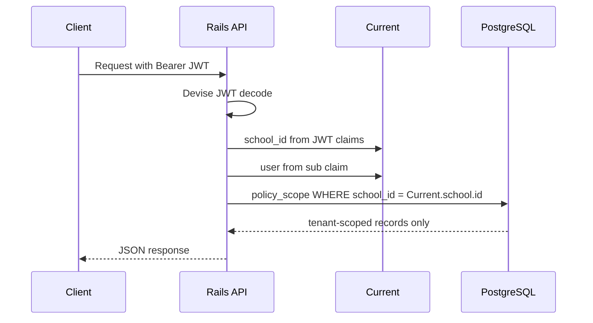

**Rules:**

1. User authenticates → JWT contains `sub` (user_id), `school_id`, `role`, `jti`, `exp`
2. `ApplicationController` sets `Current.school = current_user.school` and `Current.user = current_user`
3. All queries use `policy_scope(Model)` or explicit `Model.where(school_id: Current.school.id)`
4. **Never** accept `school_id` from request body, query params, or headers for authorization
5. `TenantScoped` concern on models adds `default_scope { where(school_id: Current.school.id) }` as safety net (disabled in console/migrations)

### 4.5 Defense in Depth

| Layer | Mechanism | Purpose |
|-------|-----------|---------|
| JWT claims | `school_id` embedded in token | Tenant identity at auth layer |
| Application | Pundit `Scope#resolve` filters all queries | Role + tenant filtering |
| Interactor | Re-validates `school_id` on write operations | Business logic safety net |
| Database | `school_id NOT NULL` + FK to `schools` | Structural integrity |
| Database | Composite indexes leading with `school_id` | Query performance + implicit filtering |
| Database (optional) | PostgreSQL Row-Level Security policies | DB-level tenant enforcement |
| Audit | `audit_logs` records cross-tenant access attempts | Compliance + incident detection |
| Tests | Request specs assert tenant A cannot read tenant B | Regression prevention |

### 4.6 PostgreSQL RLS (Optional, Recommended for Production)

```sql
ALTER TABLE students ENABLE ROW LEVEL SECURITY;

CREATE POLICY tenant_isolation ON students
    USING (school_id = current_setting('app.current_school_id')::uuid);
```

Rails sets `app.current_school_id` per request via `SET LOCAL` in a `before_action`. RLS acts as a safety net if application scoping fails.

### 4.7 Scaling Strategy

| Scale trigger | Action |
|---------------|--------|
| Read-heavy dashboards | Add PostgreSQL read replicas; route analytics to replica |
| Table >100M rows | Partition `attendance_records`, `audit_logs` by month |
| Single DB >80% CPU | Scale RDS instance vertically |
| Cache miss rate high | Increase Redis memory; tune TTLs |
| Enterprise customer | Migrate to dedicated RDS instance (see §24) |
| Single DB >10 TB | Evaluate Citus sharding or DB-per-tenant for largest tenants |

### 4.8 Migration Strategy

- **Schema migrations:** Single `db/migrate` pipeline; all tenants receive changes simultaneously
- **Data migrations:** Use `data_migrate` gem for backfills; run in background via Sidekiq for large tables
- **Tenant onboarding:** `INSERT INTO schools` + seed default roles/settings; no infrastructure provisioning
- **Tenant offboarding:** Soft-delete school (`discarded_at`); schedule hard purge after 90 days via `CleanupDiscardedRecordsJob`
- **Enterprise dedicated DB:** `pg_dump --data-only --where school_id='...'` → restore to dedicated RDS → update routing

### 4.9 Security Considerations

- Cross-tenant data access is classified as a **severity-1 security incident**
- Every request spec must include a negative test: user from school A cannot access school B resources
- Brakeman + custom RuboCop cop to flag queries without `school_id` scope
- Quarterly penetration test includes tenant isolation scenarios

---

## 5. Database Design

> **Full specification:** [database-schema.md](./database-schema.md)

### 5.1 Conventions

| Convention | Standard | Rationale |
|------------|----------|-----------|
| Primary keys | UUID v7 (time-sortable) | Globally unique; no sequential ID leakage; sortable by creation time |
| Timestamps | `created_at`, `updated_at` on all tables | Audit trail; Rails convention |
| Soft delete | `discarded_at TIMESTAMPTZ NULL` (Discard gem) | Recoverable deletion; partial indexes exclude discarded |
| Audit columns | `created_by_id`, `updated_by_id` on mutable entities | Attribution for compliance |
| Tenant column | `school_id UUID NOT NULL REFERENCES schools(id)` | Tenant isolation on every tenant-owned table |
| Naming | snake_case plural tables; `_id` suffix for FKs | PostgreSQL and Rails conventions |
| Money/scores | `DECIMAL` or `INTEGER` (not FLOAT) | Precision for grades and billing |
| Enums | `VARCHAR` with CHECK constraint or Rails enum | Readable values in raw SQL |
| JSON settings | `JSONB DEFAULT '{}'` | Flexible per-school config without migrations |

### 5.2 Entity Relationship Overview

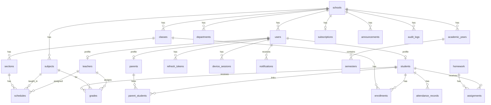

### 5.3 Domain Entity Summary

| Entity | Purpose | Key relationships |
|--------|---------|-------------------|
| **School** | Root tenant | Has all tenant-owned entities |
| **Subscription** | Billing plan | 1:1 with school |
| **User** | Auth identity + role | Belongs to school; 1:1 with profile |
| **Role** | RBAC permissions | Optional custom roles per school |
| **Permission** | Granular access (JSONB on roles) | Future custom role support |
| **RefreshToken** | JWT refresh rotation | Belongs to user |
| **DeviceSession** | Device management UI | Links to refresh token |
| **Teacher** | Teacher profile | 1:1 user; assigned to subjects/classes |
| **Student** | Student profile | 1:1 user; enrolled in classes |
| **Parent** | Parent profile | 1:1 user; linked to students |
| **Department** | Organizational unit | Tree structure (parent_id) |
| **AcademicYear** | School year boundary | Contains semesters |
| **Semester** | Term within year | Contains grades |
| **Class** | Grade level / cohort | Has sections |
| **Section** | Class division (A, B, C) | Has schedules, enrollments |
| **Subject** | Course (Math, Science) | Assigned to teachers |
| **SubjectAssignment** | Teacher-subject-class mapping | Links teacher, subject, class |
| **Enrollment** | Student-class assignment | Per academic year |
| **Schedule** | Timetable entry | Section + subject + teacher + time |
| **Lesson** | Lesson plan content | Belongs to schedule |
| **AttendanceRecord** | Daily attendance | Student + section + date |
| **Grade** | Assessment score | Student + subject + semester |
| **Homework** | Homework assignment | Subject + class; has assignments |
| **Assignment** | Student homework submission | Homework + student |
| **Exam** | Scheduled exam | Subject + class |
| **Announcement** | School-wide or targeted message | Author + target |
| **Notification** | User notification | Polymorphic notifiable |
| **Message** | Direct user-to-user message | Sender + recipient |
| **File/Attachment** | Active Storage blobs | Attached to any record |
| **AuditLog** | Compliance audit trail | User + auditable polymorphic |

### 5.4 Index Strategy

**Rule:** Every composite index leads with `school_id` to support tenant-scoped queries efficiently.

| Pattern | Example | Why |
|---------|---------|-----|
| Tenant + lookup | `INDEX(school_id, email)` on users | Login and uniqueness per tenant |
| Tenant + filter | `INDEX(school_id, role)` on users | Role-based user lists |
| Tenant + date | `INDEX(school_id, date, section_id)` on attendance | Daily attendance queries |
| Tenant + FK | `INDEX(school_id, student_id, semester_id)` on grades | Student gradebook |
| Partial | `WHERE discarded_at IS NULL` | Exclude soft-deleted from scans |
| Partial unique | `UNIQUE(school_id) WHERE current = true` on academic_years | One current year per school |
| GIN/trgm | `GIN(name gin_trgm_ops)` on students | Fuzzy name search |

### 5.5 Soft Delete Strategy

- **Discard gem** sets `discarded_at` timestamp instead of `DELETE`
- Default scopes exclude discarded records: `scope :kept, -> { where(discarded_at: nil) }`
- `CleanupDiscardedRecordsJob` hard-deletes after 90 days
- Unique constraints use partial indexes to allow re-creation after soft delete

### 5.6 Performance Maintenance

| Practice | Tool/Method | Purpose |
|----------|-------------|---------|
| No N+1 queries | `includes`/`preload` in interactors; Bullet gem in dev | Eliminate query multiplication |
| Partial indexes | `WHERE discarded_at IS NULL` | Smaller, faster indexes |
| Connection pooling | PgBouncer (transaction mode) | Handle thousands of connections |
| Vacuum/analyze | Managed PostgreSQL auto-maintenance | Prevent bloat |
| Query timeouts | `statement_timeout = 30s` | Prevent runaway queries |
| EXPLAIN ANALYZE | Required for queries >50ms in staging | Proactive optimization |
| Read replicas | Route analytics/reporting queries | Offload read-heavy workloads |

---

## 6. Frontend Architecture

> **Planning view:** [frontend-schema.md](../frontend-schema.md)

### 6.1 Principles

| Principle | Implementation |
|-----------|---------------|
| Server Components default | Data fetch on server; minimal client JS |
| Feature modules | Domain logic colocated under `src/features/<name>/` |
| Thin routes | `app/` only wires layouts and pages — no `<Feature>Page` wrappers |
| HeroUI only | No custom Button/Input/Modal replacements |
| Strict TypeScript | No `any`; typed props, API responses, form schemas |
| 4-space indentation | Project formatting standard |
| Single root element | Prefer `<div>` or semantic element over `<>...</>` |

### 6.2 Folder Structure

```
src/
├── proxy.ts                    # Auth guards, role redirect, locale (Next.js 16+)
├── app/                        # Routes + layouts only
│   ├── layout.tsx              # Root: providers, html/body
│   ├── auth/                   # Public auth → /auth/*
│   │   ├── layout.tsx
│   │   ├── login/page.tsx
│   │   ├── forgot-password/page.tsx
│   │   ├── reset-password/[token]/page.tsx
│   │   ├── verify-email/[token]/page.tsx
│   │   └── invite/[token]/page.tsx
│   ├── (dashboard)/            # Authenticated routes
│   │   ├── layout.tsx          # Sidebar + TopBar inline
│   │   ├── admin/              # Admin routes
│   │   ├── teacher/            # Teacher routes
│   │   ├── student/            # Student routes
│   │   ├── parent/             # Parent routes
│   │   ├── profile/
│   │   ├── security/
│   │   ├── notifications/
│   │   ├── messages/
│   │   └── files/
│   └── api/auth/[...all]/route.ts  # Better Auth handlers
├── actions/                    # Server Actions (revalidation, mutations)
│   └── auth/
├── components/                 # Shared composites by domain
│   ├── attachments/
│   ├── data-table/
│   ├── page-header/
│   └── charts/
├── constants/                  # App-wide constants
├── features/                   # Domain modules
│   ├── auth/
│   │   ├── components/<domain>/
│   │   ├── hooks/
│   │   ├── schemas/
│   │   ├── services/
│   │   └── types/
│   ├── students/
│   ├── teachers/
│   ├── attendance/
│   ├── grades/
│   └── ... (one per domain)
├── hooks/                      # Shared hooks
├── i18n/                       # next-intl config + request.ts
├── layout/                     # Dashboard chrome
│   ├── sidebar/Sidebar.tsx
│   └── top-bar/TopBar.tsx
├── lib/
│   ├── api/                    # Wretch client + interceptors
│   ├── auth/                   # Better Auth config
│   ├── form/                   # Shared form utilities
│   └── navigation/             # Role-based nav config
├── providers/
│   ├── ThemeProvider.tsx
│   ├── I18nProvider.tsx
│   └── AuthProvider.tsx
├── schemas/                    # Shared Zod schemas
├── styles/                     # Global CSS, Tailwind config
├── types/                      # Shared TypeScript types
└── utils/                      # Pure utility functions
```

### 6.3 Responsibility Map

| Location | Responsibility | Examples |
|----------|---------------|----------|
| `app/**/page.tsx` | Route composition only | Import feature components, pass server data |
| `app/**/layout.tsx` | Layout shells | Auth layout, dashboard layout with Sidebar |
| `proxy.ts` | Auth guards, role redirect | Redirect `/` to `/admin`, `/teacher`, etc. |
| `features/*/components/` | Domain UI | `StudentList.tsx`, `GradeForm.tsx` |
| `features/*/services/` | API calls | `students.service.ts` using Wretch |
| `features/*/schemas/` | Zod validation | `student.schema.ts` |
| `features/*/hooks/` | Domain hooks | `useStudents.ts` |
| `features/*/types/` | Domain types | `student.types.ts` |
| `components/` | Shared composites | `DataTable.tsx`, `PageHeader.tsx` |
| `lib/api/` | HTTP client setup | Wretch instance, auth interceptor, error parser |
| `lib/auth/` | Better Auth config | Session provider, token refresh |
| `providers/` | React context | Theme, i18n, auth state |
| `actions/` | Server Actions | Cache revalidation after mutations |

### 6.4 Server vs Client Components

| Use Server Component | Use Client Component |
|---------------------|---------------------|
| Initial data fetch | `useState`, `useEffect` |
| Direct backend access (server-side) | Event handlers (`onClick`, `onSubmit`) |
| SEO metadata | Browser APIs (`localStorage`, `window`) |
| Static layout shells | React Hook Form |
| Permission check before render | Optimistic UI updates |
| Non-interactive lists and tables | Recharts dashboards |
| | HeroUI interactive components (Modal, Dropdown) |

**Rule:** Add `"use client"` only when the component requires client-side interactivity. Default to Server Components.

### 6.5 API Layer (Wretch)

```typescript
// lib/api/client.ts
import wretch from "wretch";

const api = wretch(process.env.NEXT_PUBLIC_API_URL!)
    .options({ credentials: "include" })
    .middlewares([authInterceptor, errorParser]);

export default api;
```

- **Services** in `features/*/services/` call `api.url('/students').get()`
- **Auth interceptor** attaches Bearer access token from session; on 401, triggers refresh
- **Error parser** normalizes `{ error: { code, message, details } }` into typed errors
- **Server Components** use server-side fetch with forwarded cookies for SSR data

### 6.6 Authentication (Frontend)

1. User submits login form → `auth.service.ts` calls `POST /api/v1/auth/login`
2. Rails returns access token (JSON) + sets refresh token (httpOnly cookie)
3. Better Auth stores session state; access token held in memory
4. `proxy.ts` checks session on protected routes; redirects unauthenticated to `/auth/login`
5. On access token expiry: client calls `POST /api/v1/auth/refresh` with cookie
6. On refresh failure: redirect to login

### 6.7 Authorization (Frontend)

- **Route-level:** `proxy.ts` redirects users to role-appropriate dashboard (`/admin`, `/teacher`, etc.)
- **Component-level:** Server Components check role before rendering admin-only sections
- **API-level:** Backend Pundit is the authority — frontend checks are UX only, never security

### 6.8 Error Handling

| Layer | Mechanism |
|-------|-----------|
| Route segment | `error.tsx` boundaries with retry button |
| API errors | Parse error envelope → HeroUI Toast for global errors |
| Form errors | Map `details[].field` to React Hook Form `setError` |
| 401 Unauthorized | Trigger token refresh; on failure redirect `/auth/login` |
| 403 Forbidden | Show "Access Denied" page |
| 500 Server Error | Sentry capture + user-friendly error message |

### 6.9 Loading States

- `loading.tsx` per route segment for Suspense fallbacks
- HeroUI `Spinner` for client-side data fetching
- Skeleton placeholders for dashboard cards during SSR streaming

### 6.10 Optimistic UI

- Client Components update local state immediately on mutation
- Revert on API error with toast notification
- Used for: mark notification read, toggle attendance status
- Not used for: grade creation, enrollment (server authority required)

### 6.11 Caching

| Layer | Strategy |
|-------|----------|
| RSC fetch | `next: { tags: ['students'], revalidate: 60 }` |
| Client lists | Stale-while-revalidate pattern |
| Mutations | `revalidateTag('students')` via Server Actions |
| Static assets | CDN cache with content hash filenames |

### 6.12 Internationalization

- **next-intl** with locale prefix routing: `/en/admin/students`, `/uz/admin/students`
- All user-facing strings in `messages/en.json`, `messages/uz.json`
- No hardcoded UI text in components
- School-level locale default from `school.locale` setting

### 6.13 Theme

- **next-themes** for dark/light mode toggle
- HeroUI v3 CSS variables for semantic colors
- Theme preference stored in `localStorage` via next-themes
- TopBar contains theme toggle switch

### 6.14 Accessibility

- HeroUI built on React Aria — focus management, ARIA labels, keyboard navigation
- All form inputs have associated `<label>` elements
- Color contrast meets WCAG 2.1 AA
- Skip navigation link in dashboard layout
- Screen reader announcements for toast notifications

---

## 7. Backend Architecture

### 7.1 Folder Structure

```
app/
├── controllers/
│   ├── application_controller.rb
│   └── api/
│       └── v1/
│           ├── base_controller.rb
│           ├── auth_controller.rb
│           ├── students_controller.rb
│           ├── teachers_controller.rb
│           └── ...
├── models/
│   ├── concerns/
│   │   ├── tenant_scoped.rb
│   │   └── discardable.rb
│   ├── school.rb
│   ├── user.rb
│   ├── student.rb
│   └── ...
├── policies/
│   ├── application_policy.rb
│   ├── student_policy.rb
│   └── ...
├── interactors/
│   ├── students/
│   │   ├── create.rb
│   │   └── enroll.rb
│   ├── grades/
│   │   └── create.rb
│   └── organizers/
│       ├── enroll_student.rb
│       └── record_attendance.rb
├── jobs/
│   ├── send_welcome_email_job.rb
│   ├── generate_report_job.rb
│   └── ...
├── mailers/
│   ├── user_mailer.rb
│   └── notification_mailer.rb
├── views/
│   └── api/v1/
│       ├── students/
│       │   ├── index.json.jbuilder
│       │   ├── show.json.jbuilder
│       │   └── _student.json.jbuilder
│       └── shared/
│           ├── _error.json.jbuilder
│           └── _meta.json.jbuilder
├── queries/
│   ├── students/search_query.rb
│   └── analytics/dashboard_query.rb
└── services/
    ├── resend_service.rb
    └── storage_signer_service.rb

config/
├── routes.rb
├── initializers/
│   ├── devise.rb
│   ├── sidekiq.rb
│   ├── rack_attack.rb
│   └── cors.rb
└── ...

db/
├── migrate/
├── seeds/
└── structure.sql

spec/
├── models/
├── requests/
├── policies/
├── interactors/
├── jobs/
└── factories/
```

### 7.2 Folder Responsibilities

| Folder | Responsibility | Rules |
|--------|---------------|-------|
| `controllers/api/v1/` | HTTP layer: parse params, auth, authorize, delegate, render | Skinny — no business logic |
| `models/` | Persistence, associations, validations, scopes | Active Record validations only — no separate validator classes |
| `policies/` | Authorization rules and scoped queries | One policy per model |
| `interactors/` | Business logic, transaction boundaries | One interactor per use case |
| `jobs/` | Async Sidekiq work | Idempotent where possible |
| `mailers/` | Email templates and delivery | Async via `deliver_later` |
| `views/api/v1/` | Jbuilder JSON templates | Partials for DRY |
| `queries/` | Complex read-only query objects | Optional; for reporting/analytics |
| `services/` | External integrations (Resend, storage signing) | Thin wrappers |
| `concerns/` | Shared model/controller behavior | TenantScoped, Discardable |

### 7.3 Request Lifecycle

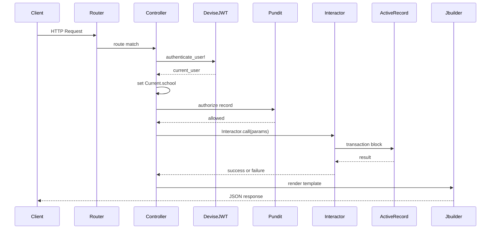

### 7.4 Controller Pattern (Skinny)

```ruby
class Api::V1::StudentsController < Api::V1::BaseController
    def create
        authorize Student
        result = Students::Create.call(
            params: student_params,
            current_user: current_user,
            school: current_school
        )
        if result.success?
            @student = result.student
            render :show, status: :created
        else
            render_error(result.error, :unprocessable_entity)
        end
    end

    def index
        @students = policy_scope(Student)
            .includes(:user, :enrollments)
            .page(params[:page])
            .per(params[:limit] || 25)
        render :index
    end
end
```

### 7.5 Interactor Pattern

```ruby
module Students
    class Create
        include Interactor

        def call
            ActiveRecord::Base.transaction do
                context.user = create_user!
                context.student = create_student!
                create_enrollment! if context.params[:class_id]
                AuditLog.record!(context.current_user, context.student, :create)
            end
        rescue ActiveRecord::RecordInvalid => e
            context.fail!(error: e.record.errors)
        end
    end
end
```

### 7.6 Transaction Handling

- Interactors wrap writes in `ActiveRecord::Base.transaction`
- `Interactor::Organizer` chains multi-step flows with shared context
- On failure: `context.fail!(error: ...)` triggers rollback
- Idempotency keys for critical operations (bulk import, payment)
- Jobs that write data use `sidekiq_options unique: :until_executed` to prevent duplicates

### 7.7 Error Handling

| Error | HTTP Status | Code |
|-------|-------------|------|
| Validation failed | 422 | `validation_error` |
| Record not found | 404 | `not_found` |
| Not authenticated | 401 | `unauthorized` |
| Not authorized | 403 | `forbidden` |
| Rate limited | 429 | `rate_limit_exceeded` |
| Server error | 500 | `internal_error` |

```json
{
    "error": {
        "code": "validation_error",
        "message": "Record could not be saved",
        "details": [
            { "field": "email", "message": "has already been taken" }
        ]
    }
}
```

### 7.8 API Versioning

```ruby
# config/routes.rb
namespace :api do
    api_version(
        module: "V1",
        path: { value: "v1" },
        defaults: { format: :json }
    ) do
        resources :students
        resources :teachers
        # ...
    end
end
```

- Breaking changes → new version (`v2`)
- v1 supported minimum 12 months after v2 release
- Deprecation communicated via `Sunset` header

### 7.9 Business Logic Organization

| Layer | Responsibility | Example |
|-------|---------------|---------|
| Controller | HTTP concerns only | Parse params, call interactor, render |
| Interactor | Business rules, orchestration | `Students::Create`, `Grades::Create` |
| Organizer | Multi-step workflows | `EnrollStudent` (create user → student → enrollment → notify) |
| Model | Validations, associations, scopes | `validates :email, uniqueness: { scope: :school_id }` |
| Policy | Authorization | `StudentPolicy#show?` |
| Query | Complex reads | `Students::SearchQuery` |
| Job | Async side effects | `SendGradeNotificationJob` |

**No separate validator classes.** All validation logic lives in Active Record model validations and Interactor precondition checks.

---

## 8. Authentication

### 8.1 Stack

| Component | Role |
|-----------|------|
| Devise | User model, password hashing (bcrypt), recoverable, confirmable |
| Devise JWT | Access token dispatch on login; denylist revocation |
| Custom `refresh_tokens` table | Refresh token rotation with reuse detection |
| Better Auth (frontend) | Session UX, cookie coordination |

### 8.2 Token Lifecycle

| Token | Lifetime | Storage | Rotation |
|-------|----------|---------|----------|
| Access JWT | 15 minutes | Client memory (never localStorage) | New token on refresh |
| Refresh token | 30 days (7 days without "remember me") | httpOnly Secure SameSite=Lax cookie | Single-use rotation |

### 8.3 Access Token

**Claims:** `sub` (user_id), `school_id`, `role`, `jti` (unique ID), `exp`, `iat`

**Lifecycle:**

1. Issued on login and token refresh
2. Sent as `Authorization: Bearer <token>` on every API request
3. Validated by Devise JWT middleware
4. On logout: `jti` added to denylist (Redis) until natural expiry
5. Expired tokens return 401 → client triggers refresh flow

### 8.4 Refresh Token

**Storage:** `refresh_tokens` table with hashed token digest (never store plaintext)

| Column | Purpose |
|--------|---------|
| `token_digest` | bcrypt hash of refresh token |
| `device_name` | "Chrome on macOS" for device management |
| `ip_address` | Login IP for audit |
| `user_agent` | Browser identification |
| `expires_at` | Token expiry |
| `revoked_at` | Set on logout or rotation |
| `replaced_by_id` | Links to new token in rotation chain |

**Rotation flow:**

1. Client sends refresh cookie to `POST /api/v1/auth/refresh`
2. Server validates digest, checks not revoked/expired
3. Issues new access + refresh token pair
4. Old refresh token `revoked_at` set; `replaced_by_id` points to new token
5. **Reuse detection:** If revoked token is presented again → revoke ALL user sessions (potential theft)

### 8.5 Authentication Flows

| Flow | Endpoint | Description |
|------|----------|-------------|
| Login | `POST /auth/login` | Validate credentials → issue token pair → audit log |
| Refresh | `POST /auth/refresh` | Validate refresh → rotate → new access token |
| Logout | `POST /auth/logout` | Revoke current refresh; denylist access `jti` |
| Logout all | `DELETE /auth/sessions` | Revoke all refresh tokens for user |
| Password reset request | `POST /auth/password` | Send reset email via Resend |
| Password reset | `PATCH /auth/password` | Validate token → update password → revoke all sessions |
| Email verification | `GET /auth/confirmation` | Set `email_verified_at` |
| List devices | `GET /auth/sessions` | Return active device sessions |
| Revoke device | `DELETE /auth/sessions/:id` | Revoke specific refresh token |

### 8.6 Remember Me

- Without "remember me": refresh token expires in 7 days
- With "remember me": refresh token expires in 30 days
- Controlled by `remember_me` boolean in login request

### 8.7 Security Controls

| Control | Implementation |
|---------|---------------|
| Password hashing | bcrypt cost factor 12+ |
| Rate limiting | 5 login attempts / 15 min / IP + email (Rack::Attack) |
| No credentials in logs | Filtered parameter logging |
| JWT denylist | Redis-backed `jti` blocklist on logout |
| Refresh rotation | Single-use with reuse detection |
| Device audit | IP + user agent recorded per session |
| Password policy | Min 12 chars; HaveIBeenPwned breach check |
| HTTPS only | Cookies marked Secure; HSTS header |

### 8.8 Audit Logging

Every authentication event is recorded in `audit_logs`:

- Login success/failure
- Logout / logout all
- Password reset request/completion
- Token refresh
- Device session revocation
- Failed authorization attempts

---

## 9. Authorization

### 9.1 RBAC Model

| Role | Scope | Capabilities |
|------|-------|-------------|
| **admin** | Full school | Manage all users, classes, settings, reports, permissions |
| **teacher** | Assigned classes/subjects | Attendance, grades, homework, exams, lessons, announcements (own classes) |
| **student** | Own records | View timetable, grades, attendance, homework, exams, announcements |
| **parent** | Linked children | View children's attendance, grades, homework; receive notifications |

### 9.2 Pundit Policy Pattern

```ruby
class StudentPolicy < ApplicationPolicy
    def index?
        admin? || teacher?
    end

    def show?
        admin? || assigned_teacher?(record) || own_student?(record) || parent_of?(record)
    end

    def create?
        admin?
    end

    def update?
        admin?
    end

    def destroy?
        admin?
    end

    class Scope < Scope
        def resolve
            scoped = scope.where(school_id: user.school_id)

            if user.admin?
                scoped
            elsif user.teacher?
                scoped.in_teacher_classes(user.teacher)
            elsif user.student?
                scoped.where(id: user.student.id)
            elsif user.parent?
                scoped.where(id: user.parent.student_ids)
            else
                scope.none
            end
        end
    end
end
```

### 9.3 Authorization Flow

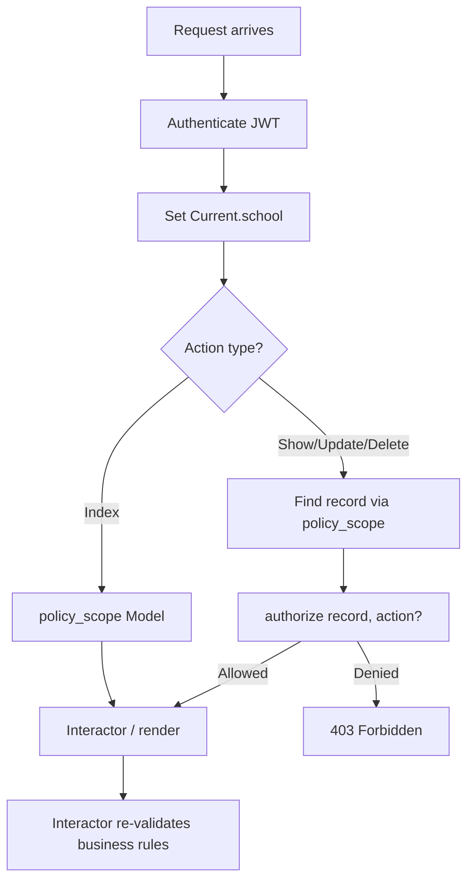

### 9.4 Permission Inheritance

| Rule | Behavior |
|------|----------|
| Admin | Inherits all permissions within tenant |
| Teacher | Permissions scoped to assigned classes/subjects only |
| Student | Read-only access to own records |
| Parent | Read-only access to linked children's records |
| Custom roles (future) | JSONB `permissions` on `roles` table overrides defaults |
| Feature flags | `school.settings` can disable modules (e.g., messaging) |

### 9.5 Tenant Isolation in Authorization

1. **Every** `Scope#resolve` starts with `where(school_id: user.school_id)`
2. **Never** use user-supplied `school_id` for scoping
3. `authorize` is called on **every** controller action (enforced by RuboCop cop)
4. Interactors re-validate that records belong to `context.school`
5. Request specs test cross-tenant access returns 404 (not 403, to avoid leaking existence)

---

## 10. REST API Design

> **Full specification:** [api-reference.md](./api-reference.md)

### 10.1 Base URL

```
https://api.tafakkur.com/api/v1
```

### 10.2 Authentication Header

```
Authorization: Bearer <access_token>
```

### 10.3 Global Conventions

#### Response Envelope (Success)

```json
{
    "data": { },
    "meta": { }
}
```

#### Response Envelope (Error)

```json
{
    "error": {
        "code": "validation_error",
        "message": "Record could not be saved",
        "details": [
            { "field": "email", "message": "has already been taken" }
        ]
    }
}
```

#### Pagination

| Parameter | Default | Max | Description |
|-----------|---------|-----|-------------|
| `page` | 1 | — | Page number (1-indexed) |
| `limit` | 25 | 100 | Records per page |

```json
{
    "data": [],
    "meta": {
        "page": 1,
        "limit": 25,
        "total": 240,
        "total_pages": 10
    }
}
```

#### Filtering

Query parameters match column names: `?class_id=uuid&status=active&role=teacher`

#### Sorting

`?sort=last_name&order=asc` — `order` defaults to `asc`; allowed fields whitelisted per resource.

#### Searching

`?q=john` — uses `pg_trgm` indexed columns (name, email, student_code).

#### Status Codes

| Code | Meaning |
|------|---------|
| 200 | OK |
| 201 | Created |
| 204 | No Content (delete) |
| 400 | Bad Request |
| 401 | Unauthorized |
| 403 | Forbidden |
| 404 | Not Found |
| 422 | Validation Error |
| 429 | Rate Limited |
| 500 | Internal Server Error |

### 10.4 Resource Summary

| Resource | Endpoints | Authz |
|----------|-----------|-------|
| **Auth** | login, refresh, logout, sessions, password, confirmation | Public + Bearer |
| **School** | show, update | admin (write) |
| **Settings** | show, update | admin |
| **Teachers** | CRUD | admin (write); admin + self (read) |
| **Students** | CRUD + enroll | admin (write); scoped read |
| **Parents** | CRUD + link_student + children | admin (write); self (read) |
| **Classes** | CRUD | admin (write); teacher (read assigned) |
| **Sections** | CRUD | admin (write); teacher (read) |
| **Subjects** | CRUD | admin (write); teacher (read) |
| **Departments** | CRUD | admin |
| **Academic Years** | CRUD | admin |
| **Semesters** | CRUD | admin |
| **Schedules** | CRUD + me | admin/teacher (write); all (read scoped) |
| **Lessons** | CRUD | teacher (write scoped) |
| **Attendance** | index + bulk create + update | teacher/admin (write); scoped read |
| **Grades** | CRUD | teacher/admin (write); scoped read |
| **Homework** | CRUD | teacher (write scoped) |
| **Assignments** | CRUD + submit | teacher (write); student (submit) |
| **Exams** | CRUD | teacher/admin (write); scoped read |
| **Announcements** | CRUD | admin/teacher (write); all (read scoped) |
| **Notifications** | index + mark_read | owner |
| **Messages** | CRUD | sender/recipient |
| **Files** | presign + create + show | authenticated + policy |
| **Reports** | create + show | admin/teacher (create); scoped read |
| **Analytics** | overview, teacher, student, parent | role-specific |
| **Health** | health, ready | public / internal |

---

## 11. Background Jobs

### 11.1 Architecture

All asynchronous work is processed by Sidekiq workers backed by Redis. Jobs are enqueued from Interactors (after successful transactions) or controllers (for non-critical async work). Sidekiq provides retry with exponential backoff, dead letter queue, and scheduled jobs via sidekiq-cron.

### 11.2 Queue Configuration

| Queue | Priority | Concurrency | Purpose |
|-------|----------|-------------|---------|
| `critical` | 1 (highest) | 3 | Payment processing, urgent notifications |
| `default` | 2 | 5 | General business logic |
| `mailers` | 3 | 3 | Email delivery |
| `reports` | 4 | 2 | PDF/CSV generation |
| `low` | 5 (lowest) | 2 | Cleanup, cache warming, analytics |

```ruby
# config/sidekiq.yml
:concurrency: 10
:queues:
  - [critical, 3]
  - [default, 5]
  - [mailers, 3]
  - [reports, 2]
  - [low, 2]
```

### 11.3 Job Catalog

| Job | Queue | Trigger | Purpose |
|-----|-------|---------|---------|
| `SendWelcomeEmailJob` | mailers | User created | Welcome email with login instructions |
| `SendPasswordResetJob` | mailers | Password reset requested | Reset link email |
| `SendEmailVerificationJob` | mailers | User registered | Email confirmation link |
| `SendInvitationJob` | mailers | Admin invites user | Invitation email with accept link |
| `SendAttendanceAlertJob` | mailers | Absence recorded | Parent notification of absence |
| `SendGradeNotificationJob` | mailers | Grade created/updated | Student + parent grade notification |
| `PublishAnnouncementJob` | default | Announcement published | Fan-out notifications to targeted users |
| `GenerateReportJob` | reports | Report requested | PDF/CSV generation → store in R2 |
| `ComputeAnalyticsCacheJob` | low | Scheduled (every 5 min) | Warm dashboard aggregate caches |
| `ProcessFileUploadJob` | default | File attached | Virus scan, image variants |
| `ExportDataJob` | reports | GDPR export requested | Full user data export |
| `CleanupExpiredTokensJob` | low | Cron (hourly) | Delete expired refresh tokens |
| `CleanupDiscardedRecordsJob` | low | Cron (daily) | Hard-delete soft-deleted records >90 days |
| `PurgeOrphanedBlobsJob` | low | Cron (weekly) | Remove unattached Active Storage blobs |

### 11.4 Retry Strategy

```ruby
class ApplicationJob < ActiveJob::Base
    sidekiq_options retry: 5, dead: true

    sidekiq_retry_in do |count, _exception|
        (count ** 4) + 15 + (rand(30) * (count + 1))
    end
end
```

| Setting | Value | Purpose |
|---------|-------|---------|
| Max retries | 5 | Exponential backoff over ~4 hours |
| Dead queue | Enabled | Failed jobs moved to dead set for manual inspection |
| Unique jobs | `until_executed` for reports/exports | Prevent duplicate report generation |
| Timeout | 30 seconds default; 5 minutes for reports | Prevent hung workers |

### 11.5 Dead Queue Management

- Sidekiq Web UI mounted at `/sidekiq` (admin auth required)
- Dead jobs inspected weekly; common failures addressed in code
- Alerts when dead queue size exceeds 50 jobs
- Manual retry or discard via Web UI

### 11.6 Idempotency

- Report generation uses `sidekiq_options unique: :until_executed`
- Email jobs check `sent_at` timestamp before sending
- Bulk imports use idempotency key in Redis to prevent duplicate processing
- Token cleanup is naturally idempotent

---

## 12. File Storage

### 12.1 Architecture

**Decision:** Active Storage with Cloudflare R2 (S3-compatible, no egress fees). AWS S3 as alternative.

| Concern | Solution |
|---------|----------|
| Upload | Direct upload via presigned URL (bypasses Rails for large files) |
| Storage | R2 bucket with private default ACL |
| Access | Signed URLs (5-minute expiry) for private files |
| Public files | School logo only — public bucket prefix with CDN |
| Processing | `ProcessFileUploadJob` for virus scan and image variants |

### 12.2 Upload Flow

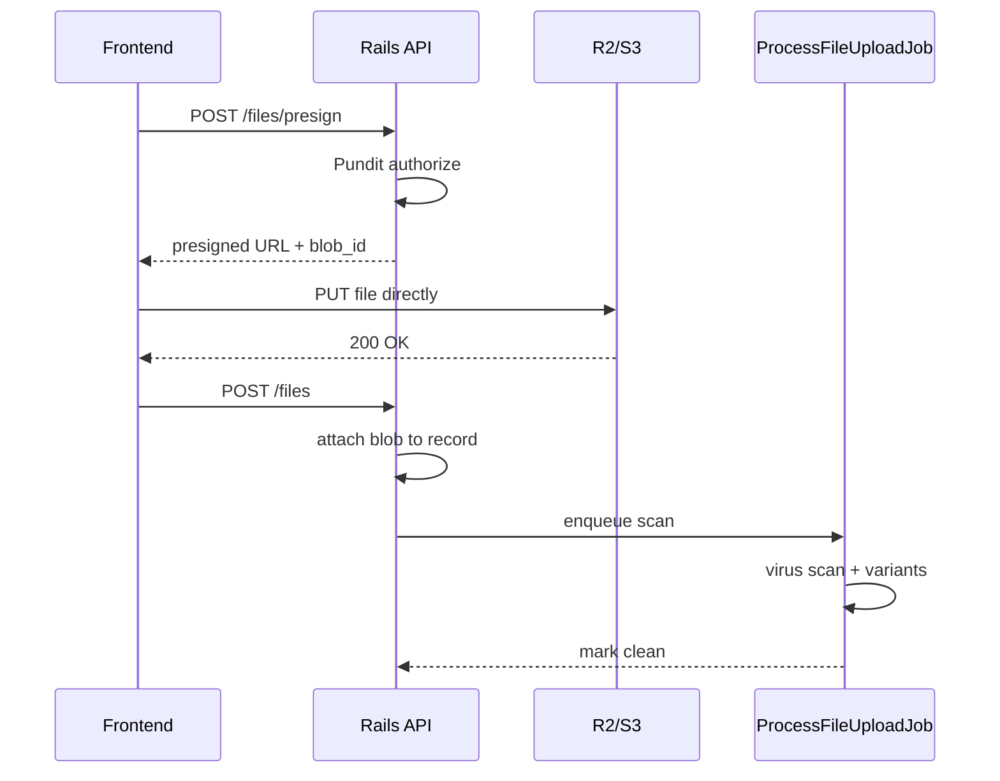

### 12.3 Authorization

| File type | Access control |
|-----------|---------------|
| Private (default) | Pundit policy check → signed URL (5 min expiry) |
| Public (school logo) | CDN URL, no auth required |
| Homework attachments | Teacher upload; student/parent download via policy |
| Report exports | Requesting user only; expires after 24 hours |

### 12.4 Validation

| Rule | Value |
|------|-------|
| Max file size | 25 MB default (configurable per school in settings) |
| Allowed MIME types | `application/pdf`, `application/vnd.openxmlformats-officedocument.*`, `image/png`, `image/jpeg` |
| Filename | Sanitized; path traversal characters stripped |
| Content-Type | Verified via Marcel gem (not trust client header) |

### 12.5 Virus Scanning

- `ProcessFileUploadJob` scans uploaded files before marking as available
- Options: ClamAV sidecar container or cloud scanning API (e.g., VirusTotal)
- Infected files: delete blob, create audit log entry, notify uploader via notification
- Scan timeout: 60 seconds; fail-closed (file quarantined until scan completes)

---

## 13. Email Architecture

### 13.1 Provider

**Resend** via Action Mailer delivery method. All emails sent asynchronously through Sidekiq `mailers` queue.

### 13.2 Templates

| Template | Trigger | Recipient | Content |
|----------|---------|-----------|---------|
| `welcome` | User account created | New user | Login URL, school name, getting started |
| `password_reset` | Password reset requested | User | Reset link (expires 6 hours) |
| `email_verification` | User registered (unverified) | User | Confirmation link |
| `invitation` | Admin invites user | Invitee | Accept invitation link with role |
| `attendance_alert` | Absence recorded | Parent(s) of student | Student name, date, class |
| `grade_notification` | Grade created/updated | Student + parent(s) | Subject, grade value, teacher |
| `announcement` | Announcement published | Targeted users | Title, body excerpt, link |

### 13.3 Design Principles

- HTML + plain text multipart (RFC 2046)
- Localized via school `locale` setting
- Async delivery: `UserMailer.welcome(user).deliver_later`
- Rate limited: max 100 emails/minute per school
- Bounce webhook from Resend → mark `email_deliverable: false` on user
- Unsubscribe link in non-transactional emails (announcements)

### 13.4 Email Flow

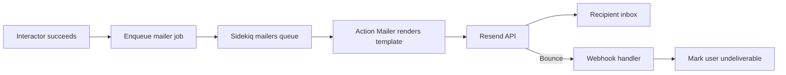

---

## 14. Security

### 14.1 OWASP Top 10 Mitigation

| # | Risk | Mitigation |
|---|------|------------|
| A01 | Broken Access Control | Pundit on every action; policy scopes; tenant isolation tests |
| A02 | Cryptographic Failures | TLS 1.3, bcrypt passwords, encrypted secrets, no PII in logs |
| A03 | Injection | ActiveRecord parameterized queries; strong params; no raw SQL without binds |
| A04 | Insecure Design | Threat modeling per feature; security review in PR process |
| A05 | Security Misconfiguration | Secure headers, default-deny CORS, Brakeman in CI, no debug in prod |
| A06 | Vulnerable Components | bundler-audit, npm audit, Dependabot auto-PRs |
| A07 | Auth Failures | Devise JWT, refresh rotation, rate limiting, MFA roadmap |
| A08 | Data Integrity Failures | FK constraints, signed URLs, CSRF not applicable (JWT API) |
| A09 | Logging Failures | Structured JSON logs, audit_logs, Sentry, no passwords in logs |
| A10 | SSRF | Allowlist external URLs; no user-controlled fetch targets |

### 14.2 Additional Controls

| Control | Implementation |
|---------|---------------|
| **Rate limiting** | Rack::Attack: 300 req/5min/IP general; 5 login/min/email |
| **CORS** | Allow only `FRONTEND_URL` origin(s); no wildcard in production |
| **CSP** | `default-src 'self'; script-src 'self'; style-src 'self' 'unsafe-inline'` |
| **Secure headers** | HSTS (max-age=31536000), X-Frame-Options DENY, X-Content-Type-Options nosniff, Referrer-Policy strict-origin |
| **HTTPS** | Enforced via ALB redirect + HSTS; cookies Secure flag |
| **Password policy** | Min 12 chars, mixed case + number required; HaveIBeenPwned API check |
| **Secrets management** | AWS Secrets Manager / Doppler; never in git; rotated quarterly |
| **Audit logs** | All mutations logged with user, action, IP, timestamp |
| **Encryption at rest** | RDS encryption enabled; R2 server-side encryption (AES-256) |
| **Encryption in transit** | TLS 1.3 everywhere; Redis TLS in production |
| **GDPR** | Data export job, deletion/anonymization workflow, consent timestamps, DPA with processors |
| **XSS** | React auto-escaping; CSP; sanitize rich text in announcements (Rails HTML sanitizer) |
| **Mass assignment** | Strong params in every controller; no `permit!` |
| **SQL injection** | ActiveRecord only; parameterized queries; Brakeman SQL check |

---

## 15. Testing

### 15.1 Backend (RSpec)

| Type | Focus | Location |
|------|-------|----------|
| Model specs | Validations, associations, scopes, tenant scope | `spec/models/` |
| Request specs | Status codes, JSON shape, auth, **tenant isolation** | `spec/requests/` |
| Policy specs | Role matrix per action (admin/teacher/student/parent) | `spec/policies/` |
| Interactor specs | Business rules, rollback on failure | `spec/interactors/` |
| Job specs | Perform, retry behavior, idempotency | `spec/jobs/` |

**Critical rule:** Every request spec includes a cross-tenant negative test — user from school A must receive 404 when accessing school B resources.

```ruby
# Example tenant isolation test
it "returns 404 for cross-tenant access" do
    other_student = create(:student, school: other_school)
    get "/api/v1/students/#{other_student.id}", headers: auth_headers
    expect(response).to have_http_status(:not_found)
end
```

### 15.2 Frontend

| Tool | Focus | Location |
|------|-------|----------|
| Jest + React Testing Library | Components, hooks, form validation | `__tests__/` colocated |
| Playwright E2E | Critical user journeys | `e2e/` |

**E2E journeys (required):**

1. Admin login → create student → enroll in class
2. Teacher login → record attendance → verify parent notification
3. Teacher login → create grade → verify student sees grade
4. Student login → view timetable
5. Parent login → view child grades
6. Password reset flow
7. Logout all devices

### 15.3 Coverage Targets

| Area | Target |
|------|--------|
| Backend models, policies, interactors | 90%+ |
| Backend request specs | 85%+ (all endpoints) |
| Frontend shared components and hooks | 80%+ |
| E2E critical journeys | 100% (all 7 journeys in CI nightly) |

### 15.4 CI Test Pipeline

1. Backend: `bundle exec rspec` (parallel via `parallel_tests`)
2. Frontend: `npm run test` (Jest)
3. E2E: `npx playwright test` (nightly + on release branches)
4. Security: Brakeman + bundler-audit + npm audit

---

## 16. Docker Setup

> **Full configuration:** [operations.md §1-2](./operations.md)

### 16.1 Overview

All services run in Docker containers for both development and production. Multi-stage builds optimize image size. Non-root users in production images.

### 16.2 Services

| Service | Image | Port | Purpose |
|---------|-------|------|---------|
| `frontend` | Node 22 Alpine | 3000 | Next.js application |
| `api` | Ruby 3.3 Slim | 3001 | Rails API (Puma) |
| `sidekiq` | Ruby 3.3 Slim | — | Background job worker |
| `db` | PostgreSQL 16 | 5432 | Primary database |
| `redis` | Redis 7 Alpine | 6379 | Cache + job queue |

### 16.3 Development

```bash
docker-compose up        # Start all services
docker-compose exec api bundle exec rails db:seed  # Seed data
```

- Source code mounted as volumes for hot reload
- Health checks on `db` and `redis` before starting `api`

### 16.4 Production

- Multi-stage Dockerfiles (builder → slim runtime)
- No source volume mounts — code baked into image
- `HEALTHCHECK` instruction on API and frontend images
- Secrets injected via environment variables (not in image)

---

## 17. CI/CD

> **Full pipeline:** [operations.md §3](./operations.md)

### 17.1 Pipeline Stages

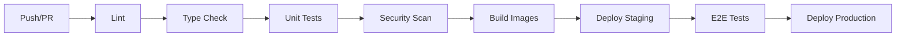

| Stage | Backend | Frontend |
|-------|---------|----------|
| Lint | RuboCop | ESLint + Prettier |
| Type check | — | `tsc --noEmit` |
| Unit tests | RSpec | Jest |
| Security | Brakeman, bundler-audit | npm audit |
| Build | Docker image → ECR | Vercel / Docker → ECR |
| Deploy | ECS rolling update | Vercel production |

### 17.2 Migration Strategy

- **Expand-contract pattern** for zero-downtime migrations:
  1. Deploy migration that adds new column (expand)
  2. Deploy app code that writes to both old and new (dual-write)
  3. Backfill data via Sidekiq job
  4. Deploy app code that reads from new column only
  5. Deploy migration that removes old column (contract)
- Migrations run **before** app deploy in CI/CD pipeline
- Rollback: revert deploy image + `rails db:rollback STEP=1` if migration is reversible

### 17.3 Rollback Strategy

1. ECS: deploy previous task definition (instant rollback)
2. Vercel: promote previous deployment
3. Database: `db:rollback` only for reversible migrations
4. Feature flags: disable new feature without code rollback

---

## 18. Production Infrastructure

> **Full detail:** [operations.md §4](./operations.md)

### 18.1 Architecture

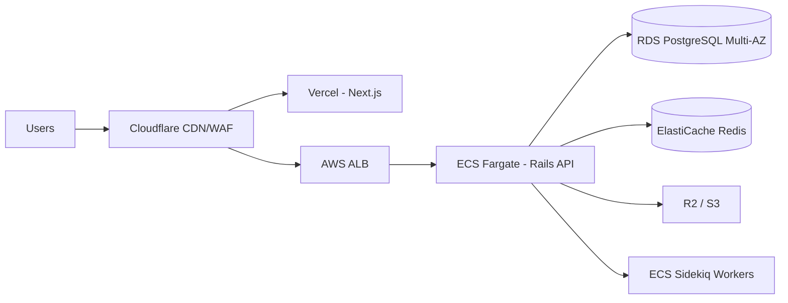

### 18.2 Component Selection

| Component | Service | Configuration |
|-----------|---------|---------------|
| Frontend | Vercel (primary) or Docker on ECS | Edge CDN, auto-scaling |
| Backend | AWS ECS Fargate | 2+ tasks, multi-AZ, auto-scaling on CPU |
| Database | RDS PostgreSQL 16 | Multi-AZ, db.r6g.large, 35-day backups |
| Cache | ElastiCache Redis 7 | Cluster mode, 2 shards |
| Storage | Cloudflare R2 + CDN | Cross-region replication |
| Secrets | AWS Secrets Manager | Auto-rotation for DB credentials |
| SSL | ACM certificates on ALB | Auto-renewal |
| DNS | Cloudflare | Proxied for WAF + CDN |
| Load Balancer | AWS ALB | Health check on `/health` |

### 18.3 Disaster Recovery

| Metric | Target |
|--------|--------|
| RTO (Recovery Time Objective) | 4 hours |
| RPO (Recovery Point Objective) | 1 hour |
| Backup frequency | RDS automated daily + R2 versioning |
| DR procedure | Restore RDS snapshot → redeploy ECS → update DNS |

---

## 19. Monitoring

> **Full setup:** [operations.md §5](./operations.md)

### 19.1 Stack

| Tool | Purpose | Integration |
|------|---------|-------------|
| Sentry | Error tracking (frontend + backend) | SDK in Rails + Next.js |
| OpenTelemetry | Distributed tracing | OTel Collector → Jaeger/Tempo |
| Prometheus | Metrics collection | Yabeda gem (Rails) + OTel metrics |
| Grafana | Dashboards and alerting | Prometheus + Loki data sources |
| Structured logging | JSON logs → CloudWatch/Datadog | `lograge` gem (Rails) |

### 19.2 Key Metrics

| Metric | Source | Alert threshold |
|--------|--------|-----------------|
| API p95 latency | Prometheus | >500ms for 5 min |
| Error rate | Sentry | >1% for 5 min |
| Sidekiq queue latency | Prometheus | >60s |
| DB connection pool | Prometheus | >80% utilization |
| DB disk usage | RDS CloudWatch | >85% |
| Redis memory | ElastiCache CloudWatch | >80% |
| ECS CPU/memory | CloudWatch | >80% for 10 min |

### 19.3 Health Endpoints

| Endpoint | Auth | Checks |
|----------|------|--------|
| `GET /health` | Public | Liveness (app running) |
| `GET /health/ready` | Internal only | DB connectivity + Redis connectivity |

### 19.4 Alerting

- PagerDuty / Opsgenie for P1 alerts (API down, DB unreachable)
- Slack channel for P2 alerts (high latency, queue backlog)
- Weekly error review meeting using Sentry dashboard

---

## 20. Performance Strategy

### 20.1 Caching Layers

| Layer | Technology | TTL | Content |
|-------|-----------|-----|---------|
| CDN | Vercel/Cloudflare | Static assets: 1 year | JS, CSS, images, fonts |
| RSC cache | Next.js | 60s default | Server-rendered pages |
| Redis | Rails.cache | 5 min | School settings, dashboard aggregates |
| HTTP cache | `Cache-Control` headers | Per endpoint | Read-heavy public data |
| DB query cache | PostgreSQL shared buffers | Automatic | Hot rows and indexes |

### 20.2 Redis Usage

| Key pattern | TTL | Purpose |
|-------------|-----|---------|
| `school:{id}:settings` | 5 min | School configuration |
| `analytics:overview:{school_id}` | 5 min | Admin dashboard aggregates |
| `analytics:teacher:{user_id}` | 5 min | Teacher dashboard |
| `ratelimit:{ip}:{endpoint}` | 15 min | Rack::Attack counters |
| `jwt:denylist:{jti}` | Until token expiry | Revoked access tokens |

### 20.3 Query Optimization

| Practice | Implementation |
|----------|---------------|
| No N+1 | `includes`/`preload` in interactors; Bullet gem in development |
| Pagination | Max 100 records per page; default 25 |
| Eager loading | Declared in interactors, not controllers |
| Partial indexes | `WHERE discarded_at IS NULL` on all soft-deleted tables |
| Query timeouts | `statement_timeout = 30s` |
| Read replicas | Analytics and report queries routed to replica |
| Search | `pg_trgm` GIN indexes on name/email columns |

### 20.4 Frontend Performance

| Technique | Target |
|-----------|--------|
| Server Components | Reduce client JS bundle |
| Code splitting | Dynamic imports for heavy features (charts, reports) |
| `next/image` | Automatic WebP/AVIF, responsive sizes |
| Font optimization | `next/font` with preload |
| Dashboard <2s LCP | Server prefetch aggregated endpoints; Redis cache 5 min TTL |

### 20.5 Background Offloading

| Operation | Why async |
|-----------|----------|
| Email delivery | Avoid blocking API response |
| Report generation | CPU-intensive PDF rendering |
| Analytics computation | Aggregate queries on large datasets |
| File virus scanning | External API call latency |
| Bulk data export | Large dataset serialization |
| Notification fan-out | N recipients per announcement |

---

## 21. Mermaid Diagrams

### 21.1 High-Level Architecture

See [§3.2](#32-component-diagram) for the full system component diagram.

### 21.2 Authentication Flow

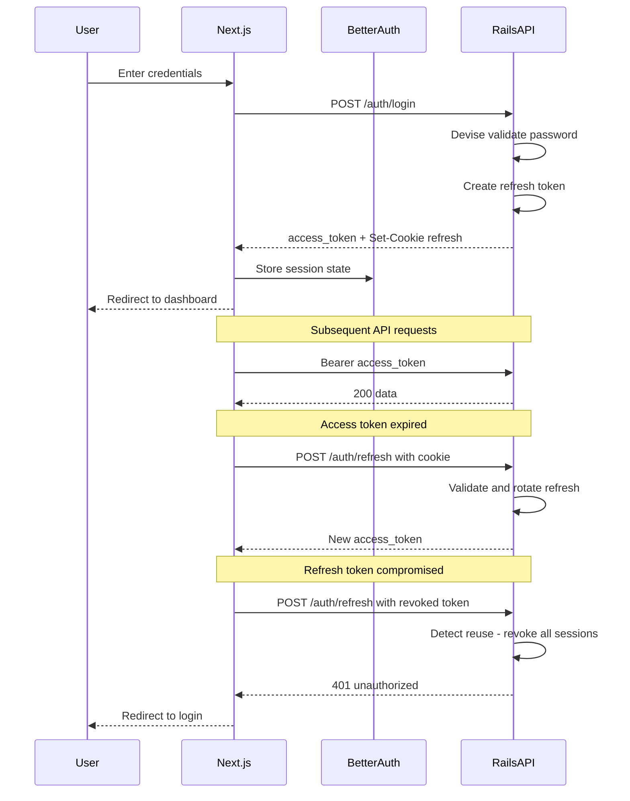

### 21.3 Request Flow

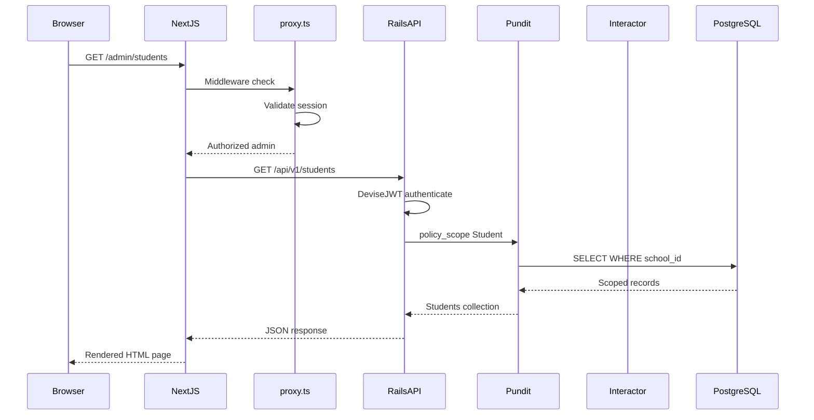

### 21.4 Database ER Diagram

See [§5.2](#52-entity-relationship-overview) for the full entity relationship diagram.

### 21.5 Teacher Creates Grade

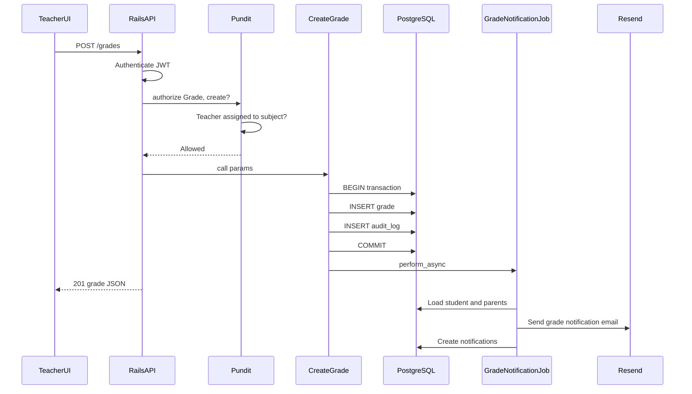

### 21.6 Student Login

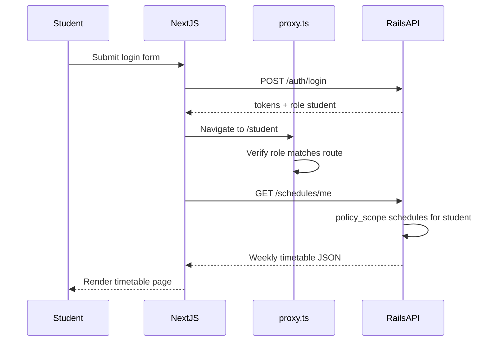

### 21.7 Attendance Creation

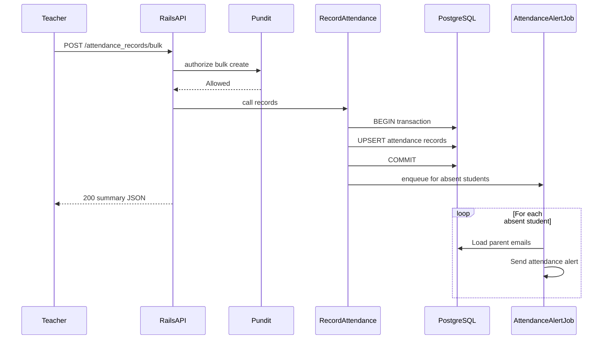

### 21.8 Parent Views Child Grades

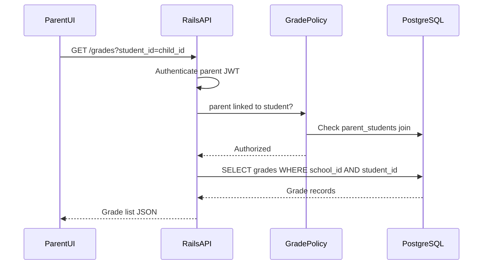

### 21.9 File Upload

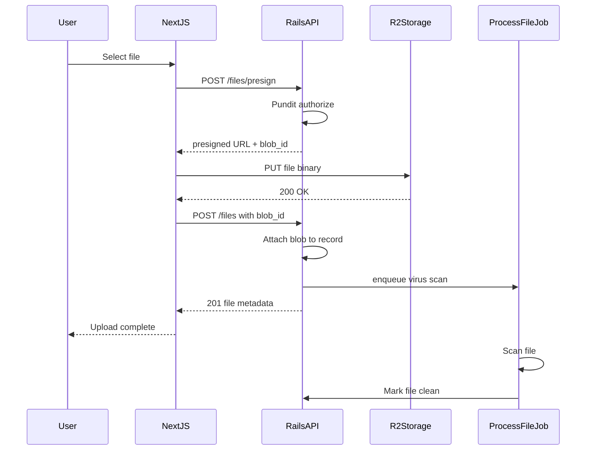

---

## 22. Development Roadmap

### Phase 1 — Foundation (Weeks 1–4)

| Deliverable | Details |
|-------------|---------|
| Monorepo scaffold | `frontend/`, `backend/`, Docker Compose |
| PostgreSQL schema | `schools`, `users`, `refresh_tokens`, `device_sessions` |
| Authentication | Devise JWT + refresh rotation + Better Auth integration |
| Multi-tenancy | `TenantScoped` concern, `Current.school`, base Pundit policies |
| CI pipeline | RuboCop, ESLint, RSpec, Jest on every PR |
| App shell | Login page, dashboard layout (Sidebar + TopBar), role redirect |

**Exit criteria:** User can register school, login, see role-appropriate empty dashboard.

### Phase 2 — Identity & School (Weeks 5–8)

| Deliverable | Details |
|-------------|---------|
| Roles & permissions | Admin/teacher/student/parent RBAC policies |
| School settings | Name, timezone, locale, branding (JSONB) |
| Academic years & semesters | CRUD, current year flag |
| Invitations | Admin invites teachers/parents via email |
| Audit logs | All mutations recorded |
| Admin dashboard skeleton | Stats cards (placeholder data) |

**Exit criteria:** Admin can configure school, create academic year, invite a teacher.

### Phase 3 — People & Structure (Weeks 9–14)

| Deliverable | Details |
|-------------|---------|
| Teachers CRUD | Profile, department assignment |
| Students CRUD | Profile, student code, enrollment |
| Parents CRUD | Profile, link to students |
| Classes & sections | CRUD with capacity |
| Subjects & departments | CRUD with codes |
| Subject assignments | Teacher-subject-class mapping |
| Enrollments | Student → class → section per year |
| Admin UI | Complete user management screens |

**Exit criteria:** Admin can set up full school structure with teachers, students, parents, classes.

### Phase 4 — Academic Operations (Weeks 15–22)

| Deliverable | Details |
|-------------|---------|
| Schedules/timetable | Weekly schedule per section |
| Lessons | Lesson plans linked to schedules |
| Attendance | Bulk entry by teacher, daily records |
| Grades/gradebook | Teacher grade entry, student/parent view |
| Homework | Create, assign, student submission |
| Exams | Schedule, max score, class/section scope |
| Teacher UI | Attendance, grades, homework, exams screens |
| Student/Parent UI | Read-only academic views |

**Exit criteria:** Teacher can take attendance, enter grades; student/parent can view results.

### Phase 5 — Communication & Insights (Weeks 23–28)

| Deliverable | Details |
|-------------|---------|
| Announcements | Targeted by role/class, fan-out notifications |
| Notifications | In-app notification center, mark read |
| Email templates | All 7 templates via Resend |
| Messaging | Direct user-to-user messages |
| Reports | Async PDF/CSV generation |
| Analytics dashboards | Admin overview, teacher/student/parent views |
| File uploads | Presigned upload, attachments on homework/announcements |

**Exit criteria:** Full communication loop — teacher posts announcement, parents receive email and in-app notification.

### Phase 6 — Production Hardening (Weeks 29–32)

| Deliverable | Details |
|-------------|---------|
| Performance tuning | Query optimization, Redis caching, CDN |
| Security audit | Brakeman, bundler-audit, penetration test |
| Load testing | Target: 10k concurrent users |
| Production deploy | ECS + Vercel + RDS + monitoring |
| Runbooks | Incident response, rollback, DR procedures |
| Documentation | API docs (rswag/OpenAPI), onboarding guide |

**Exit criteria:** Production deployment with 99.9% uptime SLA, monitoring alerts active.

---

## 23. MVP Roadmap

**MVP goal:** A single school can onboard, manage users, take attendance, record grades, and view basic reports — within **14 weeks** (Phases 1–4 subset).

### MVP Scope (Include)

| Feature | Priority |
|---------|----------|
| Auth (login, logout, password reset) | P0 |
| Admin: manage teachers, students, parents | P0 |
| Admin: manage classes, subjects, academic years | P0 |
| Teacher: attendance bulk entry | P0 |
| Teacher: grade entry | P0 |
| Student: view grades, attendance, timetable | P0 |
| Parent: view child grades, attendance | P0 |
| Email: welcome, password reset, attendance alert | P0 |
| Docker dev environment | P0 |
| Basic admin dashboard | P1 |
| Tenant isolation tests | P0 |

### Post-MVP (Defer)

| Feature | Target Phase |
|---------|-------------|
| Custom roles/permissions (JSONB) | Phase 5 |
| Advanced analytics | Phase 5 |
| Messaging | Phase 5 |
| Custom domains per school | Phase 6 |
| Mobile apps (React Native) | Future |
| Enterprise dedicated DB | Future |
| AI features (grade predictions) | Future |
| MFA / 2FA | Phase 6 |
| Real-time notifications (WebSocket) | Future |

### MVP Timeline

| Week | Milestone |
|------|-----------|
| 1–4 | Phase 1 complete — auth + multi-tenancy |
| 5–8 | Phase 2 complete — school setup |
| 9–12 | Phase 3 complete — users + structure |
| 13–14 | Phase 4 partial — attendance + grades only |

---

## 24. Future Scaling Strategy

### 24.1 Application Tier

| Trigger | Action |
|---------|--------|
| API CPU >70% sustained | Scale ECS tasks horizontally (stateless) |
| Email >1M/day | Extract notification microservice |
| Report generation impacts API latency | Extract reporting service with dedicated workers |
| Real-time needed | Add Action Cable or WebSocket service |

### 24.2 Database Tier

| Trigger | Action |
|---------|--------|
| Read-heavy analytics | Add PostgreSQL read replicas |
| `attendance_records` >100M rows | Partition by month |
| `audit_logs` >100M rows | Partition by month; archive to cold storage |
| Enterprise customer | Dedicated RDS instance; migrate via pg_dump |
| Single DB >10 TB | Evaluate Citus sharding by `school_id` |

### 24.3 Multi-Region

| Phase | Strategy |
|-------|----------|
| Phase 1 (current) | Single region (EU or US) |
| Phase 2 | Read replicas in second region |
| Phase 3 | Active-active with `school_id` affinity routing |
| Phase 4 | Data residency per region (GDPR, local regulations) |

### 24.4 Caching Evolution

| Stage | Strategy |
|-------|----------|
| Current | Redis for settings + dashboard aggregates |
| Growth | Redis Cluster for horizontal cache scaling |
| High scale | CDN caching for API responses (edge caching with short TTL) |

### 24.5 Real-Time Features

- Action Cable or dedicated WebSocket service for live notifications
- Redis pub/sub bridge between API and WebSocket servers
- Presence indicators for messaging (future)

---

## Appendix A — Domain Model Summary

| Entity | Owner | Key relationships |
|--------|-------|-------------------|
| School | Platform | Root tenant |
| User | School | Auth identity, role |
| Teacher/Student/Parent | School | 1:1 User profile |
| AcademicYear/Semester | School | Time boundaries |
| Class/Section | School | Organizational structure |
| Enrollment | School | Student ↔ Class |
| Schedule/Lesson | School | Timetable |
| AttendanceRecord | School | Daily status |
| Grade | School | Assessment |
| Homework/Assignment | School | Tasks |
| Exam | School | Assessments |
| Announcement/Notification | School | Communication |
| File/Attachment | School | Storage |
| AuditLog | School | Compliance |
| Subscription | School | Billing |

## Appendix B — Document Maintenance

Update this SAD when:

- Adding a new domain entity
- Changing multi-tenant strategy
- Adding a new external service
- Breaking API changes (new version required)

Record architectural decisions in `.cursor/docs/decisions/ADR-NNN-title.md`.

## Appendix C — Glossary

| Term | Definition |
|------|-----------|
| Tenant | A school — the unit of data isolation |
| RSC | React Server Component |
| RBAC | Role-Based Access Control |
| JWT | JSON Web Token |
| RLS | PostgreSQL Row-Level Security |
| ADR | Architecture Decision Record |
| LCP | Largest Contentful Paint |
| RTO | Recovery Time Objective |
| RPO | Recovery Point Objective |

---
